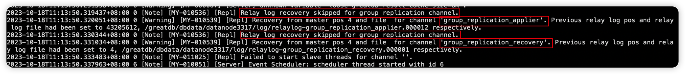

Step 1:应用本地还未应用完成的relay log
Step 2:分布式恢复，拉取本地不存在的事务到 relaylog-group_replication_recovery.000xx 使用 group_replication_recovery通道进行恢复

Step 3:初始化组通讯

Step 4:change master for channel group_replication_applier

Step 5:join group 

Step 6:Distributed incremental recovery 分布式增量恢复
在组内选择一个节点作为 donor 节点

Step 7:退出分布式恢复,恢复online

