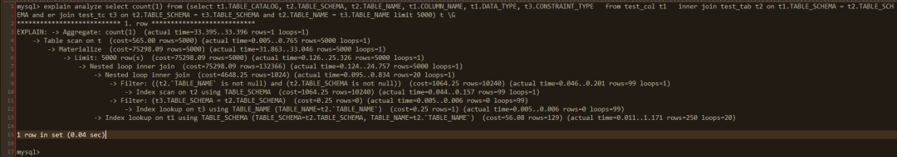
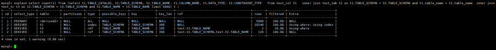

# EXPLAIN

## explian
**示例**
```
mysql> explain select * from tj1,tj2 where tj1.id=tj2.id;
+----+-------------+-------+------------+--------+---------------+---------+---------+-----------+------+----------+-------+
| id | select_type | table | partitions | type   | possible_keys | key     | key_len | ref       | rows | filtered | Extra |
+----+-------------+-------+------------+--------+---------------+---------+---------+-----------+------+----------+-------+
|  1 | SIMPLE      | tj1   | NULL       | ALL    | PRIMARY       | NULL    | NULL    | NULL      |    3 |   100.00 | NULL  |
|  1 | SIMPLE      | tj2   | NULL       | eq_ref | PRIMARY       | PRIMARY | 4       | cm.tj1.id |    1 |   100.00 | NULL  |
+----+-------------+-------+------------+--------+---------------+---------+---------+-----------+------+----------+-------+
2 rows in set, 1 warning (0.00 sec)

mysql> 
```
### 重要的列
- id
  执行顺序，序号由大到小，序号相同从上到下
- select_type
  查询类型，主要分为如下类型
  + SIMPLE              简单查询
  + PRIMARY	            最外层查询
  + UNION	            union
  + DEPENDENT UNION	    第二层或更后的union，与外层查询相关
  + UNION RESULT	    union 结果集
  + SUBQUERY	        子查询
  + DEPENDENT SUBQUERY	相关子查询
  + DERIVED	            派生表
  + DEPENDENT DERIVED	派生表，与其他table相关
  + MATERIALIZED	    物化表
  + UNCACHEABLE SUBQUERY结果无法缓存的子查询，必须为外部查询的每一行重新计算
  + UNCACHEABLE UNION	不可缓存的子查询union
- type
  连接类型
  + system  该表只有一行（=系统表），是const 类型的一个特例
  + const   该表最多有一个匹配行，通常使用Primary Key或者Union Key与常量比较时使用
  + eq_ref  除system、const 以外最好的连接类型，连接列使用主键或唯一键时
  + ref     连接列使用普通索引，或者主键唯一键的前缀时
  + fulltext连接使用的全文索引时
  + ref_or_null 与ref 类似，额外的搜索包含 NULL 值的行 `explain select * from tj1 where uid=1 or uid is null;`
  + index_merge 使用了索引合并优化
  + unique_subquery 是eq_ref 对 IN （主键）类型的子查询 `value IN (SELECT primary_key FROM single_table WHERE some_expr)`
  + index_subquery  与union_subquery 类似
  + range   使用索引进行范围扫描
  + index   全索引扫描。还区分是否回表，如果仅扫描索引不回表，则在Extra 列中显示 Using index
  + ALL     全表扫描
- ref
    该ref列显示将哪些列或常量与列中指定的索引进行比较以 key从表中选择行。
- filttered
  指按表条件过滤的表行的估计百分比，最大值100
- Extra
  额外的信息，常见示例：
  + Start temporary, End temporary  这表明临时表用于 semijoin Duplicate Weedout 策略
  + Using filesort      MySQL 必须做一个额外的过程来找出如何按排序顺序检索行。排序是通过根据连接类型遍历所有行并存储排序键和指向与WHERE子句匹配的所有行的行的指针来完成的。然后对键进行排序，并按排序顺序检索行。
  + Using temporary     为了解析查询，MySQL 需要创建一个临时表来保存结果
  + Using where         子句用于限制与下一个WHERE表匹配或发送到客户端的行
  + Using index         仅使用索引树中的信息从表中检索列信息，而无需执行额外的查找来读取实际行。当查询仅使用属于单个索引的列时，可以使用此策略。不回表
  + Using index condition   通过访问索引元组并首先对其进行测试以确定是否读取完整的表行来读取表。这样，除非有必要，否则索引信息用于延迟（ “下推” ）读取全表行
  + Using index for group-by    与Using index表访问方法类似，Using index for group-by 表明 MySQL 找到了一个索引，该索引可用于检索 aGROUP BY或 DISTINCT查询的所有列，而无需对实际表进行任何额外的磁盘访问
  + Using join buffer (Block Nested Loop), Using join buffer (Batched Key Access), Using join buffer (hash join)    来自早期连接的表被部分读入连接缓冲区，然后从缓冲区中使用它们的行来执行与当前表的连接。 (Block Nested Loop)指示使用块嵌套循环算法，(Batched Key Access)指示使用批量密钥访问算法，并(hash join)指示使用散列连接。也就是说， EXPLAIN输出前一行的表中的键被缓冲，匹配的行从出现的行所代表的表中批量提取 Using join buffer。
  + Using MRR 使用多范围读取优化策略读取表
  + Using sort_union(...), Using union(...), Using intersect(...)   index_merge这些指示显示如何为连接类型 合并索引扫描的特定算法 
  + Skip_open_table, Open_frm_only, Open_full_table 这些值表示适用于INFORMATION_SCHEMA 表查询的文件打开优化。
    * Skip_open_table: 表格文件不需要打开。该信息已从数据字典中获得。
    * Open_frm_only：表信息只需要读取数据字典。
    * Open_full_table: 未优化的信息查找。表信息必须从数据字典中读取并通过读取表文件。


## explain analyze

> explain analyze 是explain format=tree 的一个扩展，两者都会生成执行计划树，但是analyze 会实际执行select 语句，记录各个过程的执行时间，format=tree 只生成计划

**示例**
```

mysql> explain analyze select count(1) from (select t1.TABLE_CATALOG, t2.TABLE_SCHEMA, t2.TABLE_NAME, t1.COLUMN_NAME, t1.DATA_TYPE, t3.CONSTRAINT_TYPE   from test_col t1   inner join test_tab t2 on t1.TABLE_SCHEMA = t2.TABLE_SCHEMA and t1.table_name = t2.table_name  inner join test_tc t3 on t2.TABLE_SCHEMA = t3.TABLE_SCHEMA and t2.TABLE_NAME = t3.TABLE_NAME limit 3 ) t \G
*************************** 1. row ***************************
EXPLAIN: -> Aggregate: count(1)  (actual time=0.348..0.349 rows=1 loops=1)
    -> Table scan on t  (cost=2.84 rows=3) (actual time=0.003..0.004 rows=3 loops=1)
        -> Materialize  (cost=75298.09 rows=3) (actual time=0.339..0.340 rows=3 loops=1)
            -> Limit: 3 row(s)  (cost=75298.09 rows=3) (actual time=0.179..0.205 rows=3 loops=1)
                -> Nested loop inner join  (cost=75298.09 rows=132366) (actual time=0.177..0.203 rows=3 loops=1)
                    -> Nested loop inner join  (cost=4648.25 rows=1024) (actual time=0.130..0.130 rows=1 loops=1)
                        -> Filter: ((t2.`TABLE_NAME` is not null) and (t2.TABLE_SCHEMA is not null))  (cost=1064.25 rows=10240) (actual time=0.065..0.065 rows=1 loops=1)
                            -> Index scan on t2 using TABLE_SCHEMA  (cost=1064.25 rows=10240) (actual time=0.053..0.053 rows=1 loops=1)
                        -> Filter: (t3.TABLE_SCHEMA = t2.TABLE_SCHEMA)  (cost=0.25 rows=0) (actual time=0.062..0.062 rows=1 loops=1)
                            -> Index lookup on t3 using TABLE_NAME (TABLE_NAME=t2.`TABLE_NAME`)  (cost=0.25 rows=1) (actual time=0.059..0.059 rows=1 loops=1)
                    -> Index lookup on t1 using TABLE_SCHEMA (TABLE_SCHEMA=t2.TABLE_SCHEMA, TABLE_NAME=t2.`TABLE_NAME`)  (cost=56.08 rows=129) (actual time=0.044..0.070 rows=3 loops=1)

1 row in set (0.00 sec)

mysql> explain analyze select count(1) from (select t1.TABLE_CATALOG, t2.TABLE_SCHEMA, t2.TABLE_NAME, t1.COLUMN_NAME, t1.DATA_TYPE, t3.CONSTRAINT_TYPE   from test_col t1   inner join test_tab t2 on t1.TABLE_SCHEMA = t2.TABLE_SCHEMA and t1.table_name = t2.table_name  inner join test_tc t3 on t2.TABLE_SCHEMA = t3.TABLE_SCHEMA and t2.TABLE_NAME = t3.TABLE_NAME ) t \G
*************************** 1. row ***************************
EXPLAIN: -> Aggregate: count(1)  (actual time=2130.310..2130.311 rows=1 loops=1)
    -> Nested loop inner join  (cost=19704.44 rows=132366) (actual time=0.114..2006.259 rows=1333088 loops=1)
        -> Nested loop inner join  (cost=4648.25 rows=1024) (actual time=0.094..108.093 rows=10143 loops=1)
            -> Filter: ((t2.`TABLE_NAME` is not null) and (t2.TABLE_SCHEMA is not null))  (cost=1064.25 rows=10240) (actual time=0.051..17.021 rows=10338 loops=1)
                -> Index scan on t2 using TABLE_SCHEMA  (cost=1064.25 rows=10240) (actual time=0.049..12.845 rows=10338 loops=1)
            -> Filter: (t3.TABLE_SCHEMA = t2.TABLE_SCHEMA)  (cost=0.25 rows=0) (actual time=0.007..0.008 rows=1 loops=10338)
                -> Index lookup on t3 using TABLE_NAME (TABLE_NAME=t2.`TABLE_NAME`)  (cost=0.25 rows=1) (actual time=0.007..0.008 rows=1 loops=10338)
        -> Index lookup on t1 using TABLE_SCHEMA (TABLE_SCHEMA=t2.TABLE_SCHEMA, TABLE_NAME=t2.`TABLE_NAME`)  (cost=1.79 rows=129) (actual time=0.010..0.172 rows=131 loops=10143)

1 row in set (2.13 sec)

mysql>
```
>从上面的分析结果来看，在驱动表t2执行Index scan on t2 using TABLE_SCHEMA这一步的时候，就存在很大的差异了，执行快的SQL在这一步只扫描了一行记录，耗时0.053毫秒，而执行快的SQL在这一步扫描数量基本上和执行计划估计的一致，扫描了10338行记录，耗时12.845毫秒；驱动表扫描记录越多，那么和后续表关联的nested loop join次数也越多，导致两条SQL执行时间差异巨大。

>加大limit的返回限制为5000，驱动表t2扫描的行数增加至99行，执行时间增加至0.201毫秒

```
mysql> explain analyze select count(1) from (select t1.TABLE_CATALOG, t2.TABLE_SCHEMA, t2.TABLE_NAME, t1.COLUMN_NAME, t1.DATA_TYPE, t3.CONSTRAINT_TYPE   from test_col t1   inner join test_tab t2 on t1.TABLE_SCHEMA = t2.TABLE_SCHEMA and t1.table_name = t2.table_name  inner join test_tc t3 on t2.TABLE_SCHEMA = t3.TABLE_SCHEMA and t2.TABLE_NAME = t3.TABLE_NAME limit 5000) t \G*************************** 1. row ***************************
EXPLAIN: -> Aggregate: count(1)  (actual time=33.395..33.396 rows=1 loops=1)
    -> Table scan on t  (cost=565.00 rows=5000) (actual time=0.005..0.765 rows=5000 loops=1)
        -> Materialize  (cost=75298.09 rows=5000) (actual time=31.863..33.046 rows=5000 loops=1)
            -> Limit: 5000 row(s)  (cost=75298.09 rows=5000) (actual time=0.126..25.326 rows=5000 loops=1)
                -> Nested loop inner join  (cost=75298.09 rows=132366) (actual time=0.124..24.757 rows=5000 loops=1)
                    -> Nested loop inner join  (cost=4648.25 rows=1024) (actual time=0.095..0.834 rows=20 loops=1)
                        -> Filter: ((t2.`TABLE_NAME` is not null) and (t2.TABLE_SCHEMA is not null))  (cost=1064.25 rows=10240) (actual time=0.046..0.201 rows=99 loops=1)
                            -> Index scan on t2 using TABLE_SCHEMA  (cost=1064.25 rows=10240) (actual time=0.044..0.157 rows=99 loops=1)
                        -> Filter: (t3.TABLE_SCHEMA = t2.TABLE_SCHEMA)  (cost=0.25 rows=0) (actual time=0.005..0.006 rows=0 loops=99)
                            -> Index lookup on t3 using TABLE_NAME (TABLE_NAME=t2.`TABLE_NAME`)  (cost=0.25 rows=1) (actual time=0.005..0.006 rows=0 loops=99)
                    -> Index lookup on t1 using TABLE_SCHEMA (TABLE_SCHEMA=t2.TABLE_SCHEMA, TABLE_NAME=t2.`TABLE_NAME`)  (cost=56.08 rows=129) (actual time=0.011..1.171 rows=250 loops=20)

1 row in set (0.04 sec)

mysql>
```

>从上面的analyze结果，也可以看出来，在测试使用的SQL结构中，关联顺序是方法2，也就是从t2取一行数据，与t3表关联得到一行结果后，再从t1中取一行关联，每得到一行结果，返回一次数据。

>从官方文档中介绍，explain analyze是explain format=tree的补充，两者都是8.0出现的新功能，这里简单介绍一下我个人理解的查看这种执行计划的顺序，如果有不正确的地方，还请指正：最先查看第一个缩进最多的行，没有相同缩进时，再向上一个缩进查看，再查看相同缩进的行(如果它有子缩进行，也是先查看缩进最多的行)，以如下SQL为例，它的执行计划查看顺序为10->9->12->11->8->13->7->6->5->4->3



**执行流程**
1. 第一个缩进最多的行是第10行，执行计划判断以索引扫描的方式从t2表读取10240条记录，实际从t2表读取了99条记录，在读取这99条记录的操作过程中，读取到第1条记录耗时0.044毫秒，读取到第99条耗时0.157毫秒，由于它是第一个读取的表，也是查询的驱动表，只会读取一次数据
2. 查看第9行，数据从存储引擎获取后，需要在server层过滤，计划是过滤10240条记录，实际上过滤了99条记录，过滤这99条记录的过程中，第1条记录执行完成耗时是0.046毫秒，第99条记录执行完成耗时是0.201毫秒，驱动表过滤操作也只进行一次
3. 第11行与第9行缩进相同，但是由于它有子缩进第12行，所以先执行第12行，以普通索引等值查找的方式扫描t3表，这里执行计划每个关联会返回一条记录，但是实际数据返回0条，是由于这个值是平均值，即t2表的99行记录在t3表中查询记录数除以99，取整后得到的值。
4. 第12行，对从存储引擎层返回的数据，做进一步过滤，这里也循环99次
5. 第8行，t2 表与t3表的关联，关联后返回记录20条，完成关联耗时为0.834毫秒
6. 第13行，以普通索引等值查询，从t1表中获取数据,一共要完成20次循环查询，每次循环获取第一条记录的平均时间是0.011毫秒,每次循环获取最后一条记录的时间是1.171毫秒，每次循环平均获取250条记录。
7. 第7行，与t1关联查询的方法和结果，一共返回5000条记录，返回第1条记录耗时0.124毫秒，返回第5000条记录耗时24.757毫秒
8. 第6行，limit判断，耗时25.326毫秒
9. 第5行，物化这5000行记录，物化完成耗时33.046毫秒
10. 第4行，扫描物化表数据5000条记录，扫描耗时0.765毫秒
11. 第3行，数据做聚合，返回count数量，耗时33.396毫秒，也是整个SQL执行的总耗时

>explain analyze 将执行过程中的索引、连接方式、过滤等信息嵌入了每个执行步骤，初次接触时，可以使用explain结果进行对比查看，以更容易接受和理解执行过程



需要注意点：

1. explain analyze过程中会实际执行具体SQL，但并不会返回SQL的执行结果，返回的结果集是详细执行步骤
2. 目前只支持select语句，对于insert\update \delete未支持，这点和explain有差别

参考链接
https://www.mmzsblog.cn/articles/2022/05/07/1651914715938.html