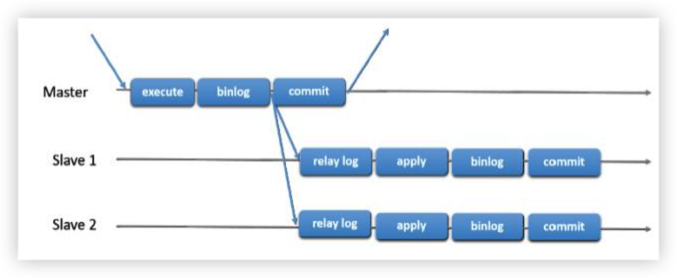
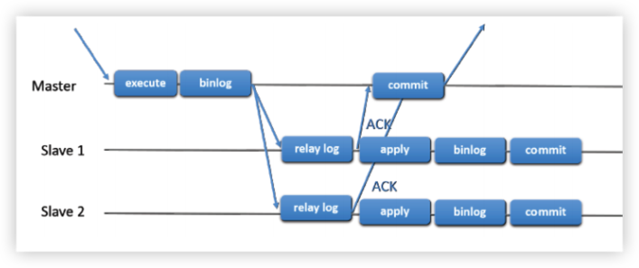
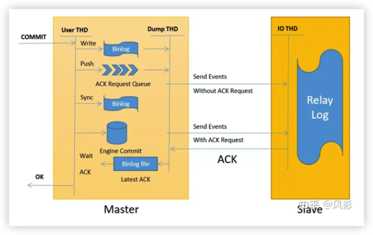
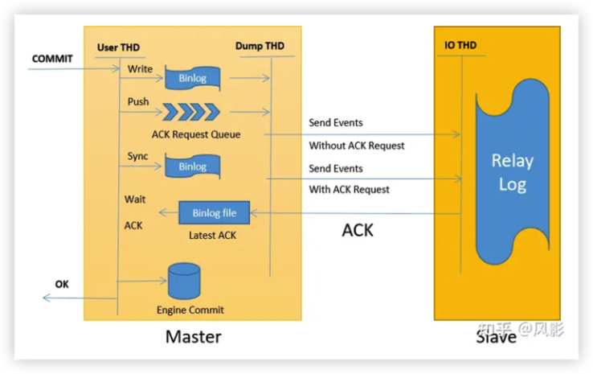
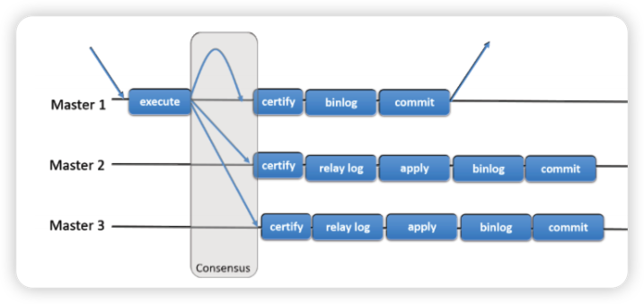
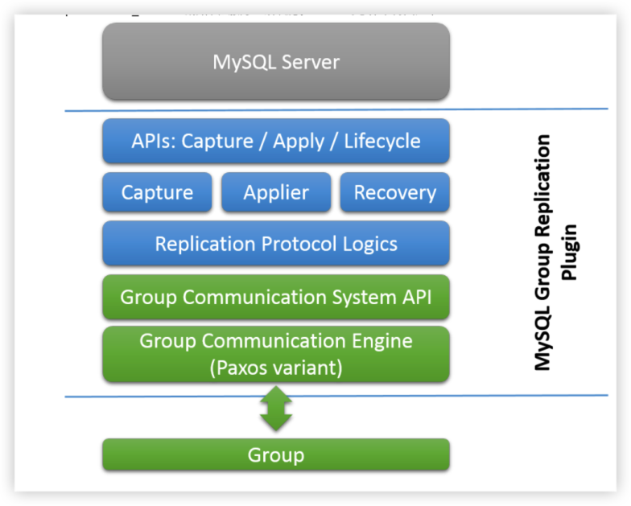
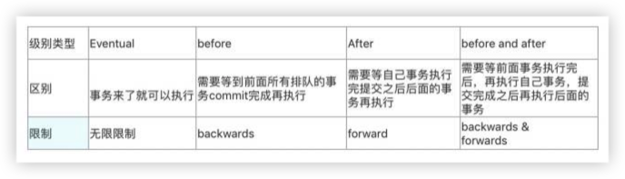
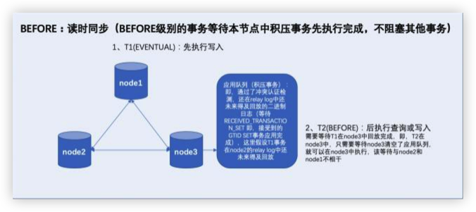
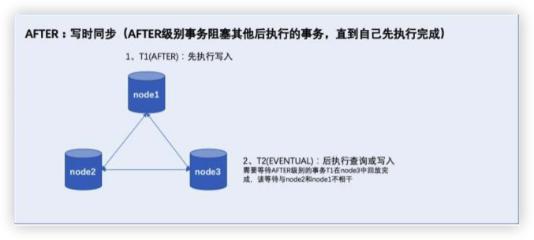

# MySQL MGR 和 Replication

## MGR 简介
> MGR 也就是 MySQL Group Replication 的简称， 这是 mysql 在 5.7.17 版本推出全新的高可用与高扩展的 解决方案，MySQL 组复制提供了高可用、高扩展、高可靠的 MySQL 集群服务。高一致性， 基于原生复制及 paxos 协议的组复制技术， 并以插件的方式提供，提供一致数据安全保证；高容错性，只要不是大多数节 点坏掉就可以继续工作，有自动检测机制，当不同节点产生资源争用冲突时，不会出现错误，按照先到者优 先原则进行处理，并且内置了自动化脑裂防护机制；高扩展性，节点的新增和移除都是自动的，新节点加入 后，会自动从其他节点上同步状态，直到新节点和其他节点保持一致，如果某节点被移除了，其他节点自动 更新组信息，自动维护新的组信息；高灵活性，有单主模式和多主模式，单主模式下，会自动选主，所有更 新操作都在主上进行；多主模式下， 所有 server 都可以同时处理更新操作。

## 主从复制
> 主从复制是异步复制，主库提交一个事务， 写入 binlog 中，然后将它们（异步地）发送到从节点， 以重新执行（在基于语句的 复制中）或应用（在基于行的复制中）。这是一个 shared-nothing 的系统，默认情况下所有 server 成员都有一 个完整的数据副本。

## 半同步复制
> 半同步复制比简单的主从复制的有点在于他同样使用 binlog，但是当从库收到并产生 relaylog 后会向主库发送一个 AcK 的信息包，当主库获得这个包后，认为从库已经获得 relaylog，那么会继续往从库发送 binlog，如果在规定参数的时间内没有接收到 ACK 包，那么就会降级为异步复制模式。

### 半同步模式
1. AFTER_COMMIT
   > after_commit等待ACK的时机是在存储引擎提交之后。具体流程如下
   

    >在该流程下，当主库提交事务之后，binlog日志写入日志文件并同步到从库的relay log，同时事务在主库的存储引擎提交。此时存在数据丢失的风险。如果主库发起提交事务，数据已经在主库的存储引擎提交(释放锁，RC 级别下其他会话可读)，在binlog还没有同步到从库之前，主库发生crash，则从库上该事务数据丢失，也会导致幻读情况。
  

2. AFTER_SYNC(增强半同步)
    > after_sync等待ACK的时机是在Flush Binlog及sync之后，存储引擎提交之前。具体流程如下
   

    > 在该流程下，当主库提交事务之后，binlog日志写入日志文件并同步到从库的relay log。但该事务在主库的存储引擎并没有提交，该事务并没有执行成功。如果此时主库在等待从库反馈ACK信息的过程中发生了crash，则该事务在主库重启之后会回滚。但会导致的一个问题是备库已经应用并提交了该事务，备库会比主库多数据。MySQL在无法解决分布式数据一致性问题的情况下，能保证的是数据不丢失。

## 组复制

+ 组复制(Group Replication)是一种可用于实现容错系统的技术。复制组是一组MySQL Server，每个Server都有自己的数据完整副本(shared-nothing复制方案)，并通过组通讯消息传递进行相互交互。组通信层提供一组保证，例如：保证消息的原子性和消息在所有组成员的整体顺序一致。这些属性非常强大，可以转换为非常有用的抽象概念，可以采用这些抽象概念来构建更高级的数据库复制解决方案。
+ 当读写事务准备在原始组成员上提交时，该成员将自动广播写入值（数据变更的行）和相应的write set（发生数据变更的行的惟一标识符）。因为事务是通过原子广播发送的，所以组中的所有成员要么都接收事务，要么都不接收事务。如果组中的所有成员都收到了该广播消息（事务），那么它们都会按 照与之前发送事务的相同顺序收到该广播消息。因此，所有组成员都以相同的顺序接收事务的写集，为事务建立全局顺序。但是，在不同组成员上并发执行的事务之间可能存在冲突。这种冲突是通过检查和比较两个不同并发事务write set来验证的，这个过程称为认证。 在认证期间，冲突检测在行级别执行的：如果在不同组成 员上执行的两个并发事务更新了同一行数据，则存在冲突。根据冲突认证检测机制判断，按照顺序，第一次提交到所有组成员上的事务继续执行提交（成功），第二次提交到所有组成员上的事务被中止（失败），因此第二个事务在事务发起的原始组成员上执行回滚，组中的其他成员对该事务执行删除（丢弃接收到的write set，不会写入relay log中）。例如，如果t1和t2在不同的位置同时执行，并且修改了同一行数据，并且t2在t1之前被排序（t2在前，t1在后），那么t2将赢得冲突（t2提交，t1回滚）。这实际上是一个分布式先提交获胜（当选）规则。请注意，如果两个事务经常发生冲突，那么最好将这两个事务放在同一个组成员中执行，这样它们在本地锁管理器的协调下将都有机会提交成功，而不至于因为 处在两个不同的组成员中由于冲突认证而导致其中一个事务被频繁回滚

#### 选主算法
    
1.  版本：哪些组成员运行的MySQL Server版本是最低的。如果所有组成员都运行在MySQL 8.0.17或更高版本上，则首先根据其发行版的补丁版本号对成员进行排序。如果任何成员运行在MySQL Server 5.7或MySQL 8.0.16或更低版本上，则首先按其发行版本的主版本号对成员进行排序（忽略补丁版本号）
2. 权重 如果组中有多个成员运行在最低版本的MySQL Server上，则要考虑的第二个因素是每个成员的成员权重设置值，该值由每个成员上的系统变量group_replication_member_weight指定（有效值为0~100的数字，默认值为50）。如果组中的任 何成员运行在MySQL Server 5.7上，此时对该组成员忽略第二个考虑因素（因为系统变量 group_replication_member_weight是8.0版本引入，5.7版本不支持）。如果该组成员支持系统变 量group_replication_member_weight，则，可以使用该系统变量对硬件性能较好的组成员增加此权重，以增加被选为主要节点的优先级顺序，或者确保在主要节点的例行维护期间将故障转移到 指定的成员（调低权重值可以降低其排序顺序，调高权重值可以增加其排序顺序）
3. UUID 如果不止一个成员运行在低版本的MySQL Server上，且其中不止一个成员 的权重值无效（不支持系统变量group_replication_member_weight），则就需要考虑第三个因素，即按照每个成员的UUID号进行排序（按照每个组成员的server_uuid系统变量值排序），选择 具有最小UUID值的成员作为主要节点。该因素是最后一个可靠的决定因素，因为它可以在第一和第二因素不生效时，使所有的组成员达成最终一致的决策（按照相同的顺序排序UUID并选择最小 值，所有组成员能够达成一致，因为组复制是从5.7版本引入的，且UUID是5.6就已经引入，所有 组复制成员都支持UUID）

#### 插件架构

+ MGR 插件包含一组用于捕获(capture)，应用(apply)和生命循环（lifecycle）的API接口，这些API接口控制着MGR插件如何与MySQL Server交互。这些接口是放置在事务执行管道中的一些钩子（它们将MySQL Server的核心与组MGR插件隔离开来），逻辑上将MySQL Server内核与MGR插件隔离开来 。其中有一些接口提供把通讯信息从Server发送给MGR插件（例如：Server启动、恢复、接受连接以及  Server即将提交事务的事件通知），有一些接口提供把通讯信息从MGR插件发送给MySQL Server（例 如： MGR插件命令MySQL Server提交、终止一个正在执行的事务，或者让该事务写入relay log中排队 等候处理）
+ 在这些API接口的下一层，是一组组件(capture、applier、Recovery)，组复制中的三个核心模块，当上层API发生调用，将根据调用类型路由到下面这三个模块执行相应的逻辑：
  +  capture 组件负责跟踪与正在执行的事务相关的上下文信息
  +  applier 组件负责在数据库上执行(应用)远程事务，其实就是读取relay log中数据进行回放
  +  Recovery 组件管理数据库节点的分布式恢复相关的工作，以及负责在一个新的Server（joiner）加 入集群时选择一个捐赠者(donor)，协调joiner节点的数据追赶的更新步骤（包括相关的数据回追，失败处理等），以及对选择捐赠者(donor)失败之后做出一些响应。  简而言之就是管理组成员的recovery
+ 继续沿着堆栈向下，复制协议模块包含复制协议中的一些特定逻辑。例如：处理冲突检测，并接收和传播事务到组中MGR 插件体系结构的最后两层是组通信系统(GCS) API和基于paxos 的组通信引擎(XCom)的实现。
+ GCS API是一个高级API，它抽象了构建复制状态机所需的属性。因此，它将消息层的实现与插件的其余上层组件解耦。组通信引擎处理与复制组成员之间的通信，主要提供基于Paxos协议的变体实现的数据一致性核心功能

#### 事务一致性级别
> 事务一致性级别由系统变量group_replication_consistency进行设置，可以在会话级别根据需要动态对.某个事务进行设置，你可以使用这些不同设置值来灵活地为组复制中事务提供一致性保证。  

+ EVENTUAL：RO和RW事务在执行之前都不会等待前面的事务应用完成（即，事务直接执行，不等待积压事务应用完成）。这是group_replication_consistency变量的默认值（也是引入该系统变量之前组
复制的默认行为）。
+ BEFORE_ON_PRIMARY_FAILOVER：新RO或RW事务在新当选的主要节点应用完成来自旧的主要节点
的积压事务之前，会被保持(不应用，类似于处在等待状态，积压事务被应用完成之后，才会处理新的   RO和RW事务)。  这确保当主要节点故障转移发生时，客户端总是能查询到发生故障的主要节点上的最新值，从而保证了一致性。  但这意味着新的主要节点在应用积压事务过程中的延迟（这里指的是客户端
访问新主要节点的响应延迟）客户端需要自行处理。  通常这种延迟很小，但是实际延迟时间的长短取决 于积压事务的大小
+ BEFORE：读时同步（读事务），写时不同步（写事务）。RW事务在应用(applied)之前会等待所有前面的事务（积压事务）完成。RO事务在执行(executed)之前会等待所有前面的事务（积压事务）完成。这样使得事务仅通过牺牲响应延迟就可以确保读取到最新的值。实际上，只是确保了RO事务上的同步，对于RW事务来说，只是等待了它之前积压的事务完成，并不会等待它在所有的其他组成员上完成应用（不过，由于RO事务要求同步，RO事务能够将一部分甚至大部分数据进行同步，所以能够一定 程度上减少RW事务上的同步开销，也就是说，该一致性级别适合于写多读少的场景）。BEFORE级别可以大致理解为是通过牺牲少量的读事务延迟来尽量换取的写事务的实时性；或者理解为由于读事务要求实时性，所以需要牺牲并发性，而写事务不需要实时性，所以不需要牺牲并发性。
+ AFTER：写时同步（写事务），读时不同步（读事务）。RW事务会等待它的更改被应用到所有其他成员。此一致性级别对RO事务没有影响（因为RO事务不会产生数据变更）。它只确保在本地成员上提交 RW事务时，该RW事务的数据变更会在组中其他所有成员中应用，以便所有后续的事务在任何成员上都能够获取到最新的数据（通过确保只在RW事务上使用同步，RW事务会将所有写入的新数据都实时同步到组中其他的所有成员中，这就减少了RO事务上的同步开销。  也就是说，该一致性级别比较适合 读多写少的场景）。AFTER级别可以大致理解为牺牲少量写事务的延迟来尽量换取读事务的实时性；或者理解为由于写事务要求实时性，所以需要牺牲并发性，而读事务不需要实时性，所以不需要牺牲并发性。
+ BEFORE_AND_AFTER：读写时都同步（读写事务）。一致性级别要求最高，RW和RO事务执行时都要求数据同步，RW事务在执行时需要等待之前的积压事务应用完成，且需要等待自己的数据变更在其 他所有组成员上都应用。RO事务在执行时需要等待之前的积压事务应用完成。该一致性级别适合对数 据的读写一致性都要求高的场景

#### 事务一致性级别对比

+ BEFORE（backwards）：也就是读时同步，就是指的读数据的时候（注意：RW事务也是要先查询旧的数据才能修改的），向前控制，即等待前面的事务应用完成，确保自己读的数据是最新的

+ AFTER（forward）：也就是写时同步，就是指的写入的数据必须要确保即时同步到其他节点，向后控制，即确保后来的事务读取到的数据是最新的
