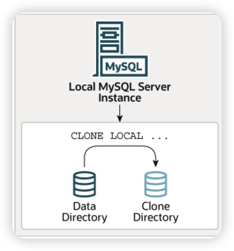
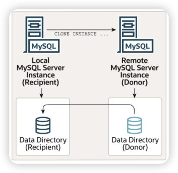
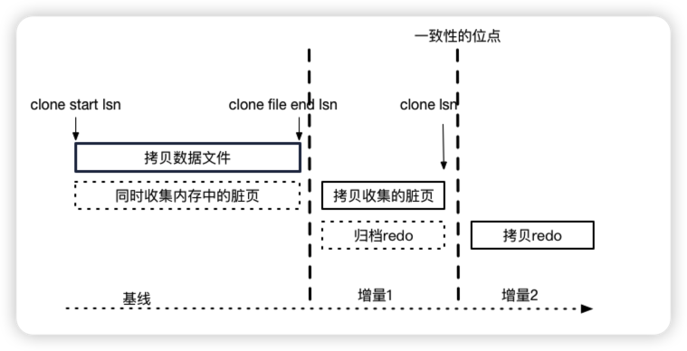
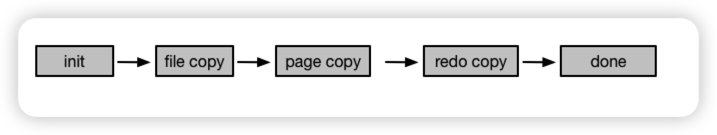

# MySQL Clone

---

从MySQL 8.0.17 开始，MySQL提供了克隆插件，支持本地克隆和远程克隆。克隆数据为InnoDB 数据快照。克隆操作支持复制，克隆时会提取和传输复制坐标并应用到Recipient 接受者，所以，克隆适用于MGR和复制。

---

## 安装克隆插件

1. 安装克隆插件的机器需配置 plugin_dir 参数
   克隆插件名为 mysql_clone.so
2. 配置文件添加 plugin-load-add 参数
    ```
    [mysqld]
    plugin-load-add=mysql_clone.so
    ```
3. 运行时安装
   `INSTALL PLUGIN clone SONAME 'mysql_clone.so';`
4. 验证是否安装成功
   ```
   mysql> SELECT PLUGIN_NAME, PLUGIN_STATUS
       FROM INFORMATION_SCHEMA.PLUGINS
       WHERE PLUGIN_NAME = 'clone';
    +------------------------+---------------+
    | PLUGIN_NAME            | PLUGIN_STATUS |
    +------------------------+---------------+
    | clone                  | ACTIVE        |
    +------------------------+---------------+
   ```


## Local Clone


1. 克隆权限配置
    本地克隆操作需要提供 BACKUP_ADMIN 权限
    `mysql> GRANT BACKUP_ADMIN ON *.* TO 'clone_user';`
2. 克隆目录配置
   本地克隆操作从本地MySQL 数据目录克隆到另一个目录
   `mysql> CLONE LOCAL DATA DIRECTORY = '/path/to/clone_dir';` 此操作即发起克隆
    > 需指定绝对路径，clone_dir 不能已存在，并且MySQL Server 必须具有创建该目录的权限。所有用户创建的InnoDB 表和表空间、InnoDB系统表空间、redo log、undo 表空间都会被克隆到指定目录.

### 限制
1. 本地克隆不支持克隆驻留在数据目录之外的用户创建的表或者表空间
   
---


## Remote Clone

远程克隆操作由接受者(Recipient)发起,数据来源于远程的MySQL Server 捐赠者(Donor).

### 语法
```
CLONE INSTANCE FROM 'user'@'host':port
IDENTIFIED BY 'password'
[DATA DIRECTORY [=] 'clone_dir']
[REQUIRE [NO] SSL];
```
> `[DATA DIRECTORY [=] 'clone_dir']` 是可选的，当不允许删除接受者本地数据目录下用户相关表、表空间、日志等数据时需要指定额外的目录接收数据。当不设置此选项时，克隆操作会自动移除数据目录下的原数据，将捐赠者数据克隆至数据目录，完成后自动重启数据库实例。

### 远程克隆前置条件
1. 捐赠者和接受者都要安装克隆插件
2. 需要执行克隆操作的用户
   1. 在捐赠者Donor上需要克隆用户需要 BACKUP_ADMIN 权限，用于访问和传输数据，以及阻塞DDL操作。8.0.27 版本前，Clone 会阻塞DDL，8.0.27之后，CLone 期间允许DDL.
   2. 在接受者Recipient，克隆用户需要 CLONE_ADMIN，用于更换捐赠的数据，阻塞克隆期间的DDL 操作，并且在克隆完成后自动重启实例.CLONE_ADMIN 包含BACKUP_ADMIN和SHUTDOWN 权限.
3. CLONE INSTANCE 检查项
   1. 捐赠者和接收者必须为相同版本，切 >= 8.0.17 版本.
   2. 捐赠者和接受者必须运行在相同的操作系统和平台.
   3. 检查接受者是否有足够的磁盘空间
   4. 如果捐赠者存在部分表存在于数据目录之外，那么克隆操作需能访问该目录和文件
   5. 已激活插件，包括任何加密插件，在捐赠者激活那么在接受者也需要激活
   6. 捐赠者和接受者需要有相同的字符集和校对规则
   7. 捐赠者和接受者须有相同的 innodb_page_size、innodb_data_file_path,innodb_data_file_path 需设置相同数量、相同大小的数据文件.
   8. 如果需要加密或者页面压缩，捐赠者和接受者必须具有相同的文件系统块大小，压缩还需要接受者文件系统支持稀疏文件和打孔.
   9. 加密数据需要安全链接
   10. 在接受者配置clone_valid_dondor_list，必须包括捐赠者IP 地址
   11. 只能有一个克隆进程
   12. 克隆插件以1M 数据包和元数据方式传输数据，所以max_allow_packet 必须大于 2M
   13. 在捐赠者上不允许使用相同的undo log 名，因为undo log 会被统一传输至接受者的innodb_undo_directory
    ```
    mysql> SELECT TABLESPACE_NAME, FILE_NAME FROM INFORMATION_SCHEMA.FILES
       WHERE FILE_TYPE LIKE 'UNDO LOG';
    ```
   14. 接收者完成克隆后会自动重启，重启依赖守护进程


### 远程克隆实例
1.  登录捐赠者创建用户并赋权，安装克隆插件
    ```
    mysql> CREATE USER 'donor_clone_user'@'example.donor.host.com' IDENTIFIED BY 'password';
    mysql> GRANT BACKUP_ADMIN on *.* to 'donor_clone_user'@'example.donor.host.com';
    mysql> INSTALL PLUGIN clone SONAME 'mysql_clone.so';
    ```
2.  登录接受者创建用户并赋权，安装克隆插件,添加捐赠者列表
    ```
    mysql> CREATE USER 'recipient_clone_user'@'example.recipient.host.com' IDENTIFIED BY 'password';
    mysql> GRANT CLONE_ADMIN on *.* to 'recipient_clone_user'@'example.recipient.host.com';
    mysql> INSTALL PLUGIN clone SONAME 'mysql_clone.so';
    mysql> SET GLOBAL clone_valid_donor_list = 'example.donor.host.com:3306';
    ```
3.  登录接受者执行克隆操作
   ```
   mysql> CLONE INSTANCE FROM 'user'@'example.donor.host.com':3306
       IDENTIFIED BY 'password'
       DATA DIRECTORY = '/path/to/clone_dir';
   ```
    如需指定接收目录，参照如下命令
    ```
    mysql> CLONE INSTANCE FROM 'user'@'example.donor.host.com':3306
       IDENTIFIED BY 'password'
       DATA DIRECTORY = '/path/to/clone_dir';
    ```


### 注意事项
1. 默认情况下，在捐赠者数据目录下的用户创建表、表空间等会被克隆至接受者的数据目录下（在不指定clone_dir情况下）
2. 创建在捐赠者数据目录之外的用户表及表空间会被克隆至接受者的相同位置下
3. 默认情况下，InnoDB系统表空间、重做日志和撤销表空间会被克隆到捐赠者配置的相同位置，除非指定了 clone_dir
   

---

## 克隆和并发DDL
在MySQL 8.0.27 之前，克隆期间接受者和捐赠者不允许进行DDL 操作，包括TRUNCATE TABLE。

为了防止在克隆操作期间并发 DDL，在捐赠者和接受者上获取独占备份锁。该clone_ddl_timeout变量定义克隆操作等待备份锁的捐赠者和接受者的时间（以秒为单位）。默认设置为 300 秒。如果在指定的时间限制内没有获得备份锁，克隆操作将失败并报错。

从 MySQL 8.0.27 开始，捐助者默认允许并发 DDL。捐助者的并发 DDL 支持由变量控制clone_block_ddl。可以使用语句动态启用和禁用并发 DDL 支持SET。
```
SET GLOBAL clone_block_ddl={OFF|ON}
```
> 默认设置为 clone_block_ddl=OFF，它允许在捐赠者上并发 DDL。并发 DDL 操作的效果是否被克隆取决于 DDL 操作是否在克隆操作拍摄动态快照之前完成。

无论设置如何，在克隆操作期间都不允许的 DDL 操作 clone_block_ddl包括：
+ ALTER TABLE tbl_name DISCARD TABLESPACE;
+ ALTER TABLE tbl_name IMPORT TABLESPACE;
+ ALTER INSTANCE DISABLE INNODB REDO_LOG;


## 复制克隆
克隆插件支持复制。除了克隆数据之外，克隆操作还从捐赠者那里提取复制坐标并将其传输给接收者，这使得可以使用克隆插件来配置组复制成员和副本。使用克隆插件进行配置比复制大量事务要快得多，效率也高得多。

在克隆操作期间，二进制日志位置（文件名、偏移量）和 gtid_executed GTID集被提取并从捐赠者 MySQL 服务器实例传输到接收者。此数据允许在复制流中的一致位置启动复制。保存在文件中的二进制日志和中继日志不会从捐赠者复制到接收者。

在克隆的MySQL实例上查询二进制位置和传输给接受者的GTID 集:
```
mysql> SELECT BINLOG_FILE, BINLOG_POSITION FROM performance_schema.clone_status;
mysql> SELECT @@GLOBAL.GTID_EXECUTED;
```

## 监控克隆操作

### 通过状态表监控
可以通过接受者 Recipient performance_schema 下的clone_status、clone_progress 表监控克隆操作的状态和进度信息。

+ clone_status表提供了当前或上次执行的克隆操作的状态。克隆操作有四种可能的状态： Not Started、In Progress、Completed和 Failed。
+ clone_progress表按阶段提供当前或上次执行的克隆操作的进度信息。克隆操作的阶段包括DROP DATA、 FILE COPY、 PAGE_COPY、 REDO_COPY、 FILE_SYNC、RESTART和RECOVERY。

### 通过events_stages 监控

1. 启动采集器
   ```
   mysql> UPDATE performance_schema.setup_instruments SET ENABLED = 'YES'
       WHERE NAME LIKE 'stage/innodb/clone%';
    ```
2. 启动消费者
   ```
   mysql> UPDATE performance_schema.setup_consumers SET ENABLED = 'YES'
       WHERE NAME LIKE '%stages%';
    ```
3. 模拟克隆操作
   ```
   mysql> CLONE LOCAL DATA DIRECTORY = '/path/to/cloned_dir';
   ```
4. 查看stages 监控
    ```
    mysql> SELECT EVENT_NAME, WORK_COMPLETED, WORK_ESTIMATED FROM performance_schema.events_stages_current
       WHERE EVENT_NAME LIKE 'stage/innodb/clone%';
    +--------------------------------+----------------+----------------+
    | EVENT_NAME                     | WORK_COMPLETED | WORK_ESTIMATED |
    +--------------------------------+----------------+----------------+
    | stage/innodb/clone (redo copy) |              1 |              1 |
    +--------------------------------+----------------+----------------+
    ```
    如果克隆操作完成，events_stages_current表将返回一个空集。在这种情况下，您可以检查 events_stages_history表以查看已完成操作的事件数据。例如：
    ```
    mysql> SELECT EVENT_NAME, WORK_COMPLETED, WORK_ESTIMATED FROM events_stages_history
       WHERE EVENT_NAME LIKE 'stage/innodb/clone%';
    +--------------------------------+----------------+----------------+
    | EVENT_NAME                     | WORK_COMPLETED | WORK_ESTIMATED |
    +--------------------------------+----------------+----------------+
    | stage/innodb/clone (file copy) |            301 |            301 |
    | stage/innodb/clone (page copy) |              0 |              0 |
    | stage/innodb/clone (redo copy) |              1 |              1 |
    +--------------------------------+----------------+----------------+
    ```

## 终止克隆

`kill  processlist_id`

可以在接受者上查看clone_status 或者information_schema.processlist、show processlist 获取PID（processlist_id）
示例：
```
mysql> SELECT * FROM performance_schema.clone_status\G
*************************** 1. row ***************************
             ID: 1
            PID: 8
          STATE: In Progress
     BEGIN_TIME: 2019-07-15 11:58:36.767
       END_TIME: NULL
         SOURCE: LOCAL INSTANCE
    DESTINATION: /path/to/clone_dir/
       ERROR_NO: 0
  ERROR_MESSAGE:
    BINLOG_FILE:
BINLOG_POSITION: 0
  GTID_EXECUTED:
```


## 克隆限制
1. MySQL 8.0.27 前不允许对捐赠者和接受者进行DDL，克隆期间通过备份锁阻塞DDL。8.0.27 之后允许并发DDL，通过clone_block_ddl 参数控制。
2. 克隆操作只允许在相同版本进行，且版本大于 8.0.17
3. 克隆不支持并行，一次只能克隆一个实例
4. 远程克隆操作不支持执行的X 协议端口 mysqlx_port
5. 克隆插件不支持克隆MySQL配置，接收方MySQL 实例保留齐配置
6. 克隆插件不支持克隆二进制日志
7. 克隆插件只支持InnoDB
8. 本地克隆操作不支持克隆使用绝对路径创建的通用表空间。与源表空间文件具有相同路径的克隆空间文件会导致冲突.


## 克隆原理及流程

### 基本原理
克隆最基本的要求就是要保证把克隆源的一个一致性的状态拷贝到另一个数据目录中，那么插件是如何保证拷贝完成时是一个一致性的点呢，这涉及到snapshot的概念，源库的一个snapshot就是一个一致性的状态点，拷贝源库的snapshot到目的数据目录就保证了目的数据目录具有源库的历史一致性状态。

### Clone snapshot



每一步的分界点都以lsn来区分 基线拷贝所有的文件（clone start lsn -> clone file end lsn) 增量1拷贝 clone start lsn到clone file end lsn之间搜集的脏页 增量2拷贝 clone file end lsn到clone lsn归档的redo

一致性原理： clone开始的时候所有已经flush的数据都通过文件拷贝了，而未flush的将被记录下来了 clone结束的时候:  到最近的checkpoint的脏页都被记录下来了，这些脏页应用到全量文件上就等价于最近的checkpoint，而checkpoint以后的增量通过拷贝归档redo来实现。这个截止点clone lsn（对应的binlog位点)就被完整的拷贝到了目的实例

snapshot因此被分成了如下几种状态：


实现snapshot必须实现脏页收集和redo归档 脏页收集： 脏页收集可以有两种方式：1. 在mtr 提交脏页时，2. i/o线程刷脏时。目前为了不影响mtr的并发选择了后者

一些关键点:
1. 通过内存的队列去缓存修改的脏页和spaceid，page_id
2. 不重复记录相同的spaceid,pageid
3. 通过后台不停的追加写文件，防止内存撑爆
4. 元信息不单独维护，文件名和头包括必要的信息
5. 文件头中记录了开始和结束的lsn.
6. 如果缓存满了会导致flushpage被阻塞，但是这种情况应该很少，
7. 内存不足时会告警和停止收集脏页，同时会重启clone的流程

redo归档：
1. 后台归档线程从checkpoint LSN开始归档redo 这个后台线程就是之前的脏页搜集线程
2. 每次都按块从上次copy的lsn到最新的flush lsn把日志从redo file拷贝到archive file
3. 拷贝的速度基本上要比redo生成的速度快，为了防止归档日志被覆盖，mtr在归档日志将要被覆盖时会柱塞mtr
4. 归档日志通过lsn命名