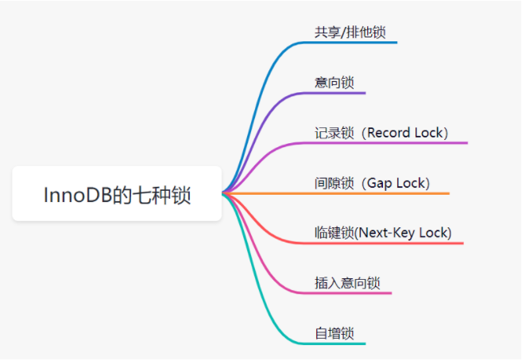
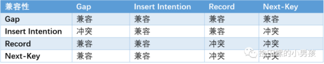
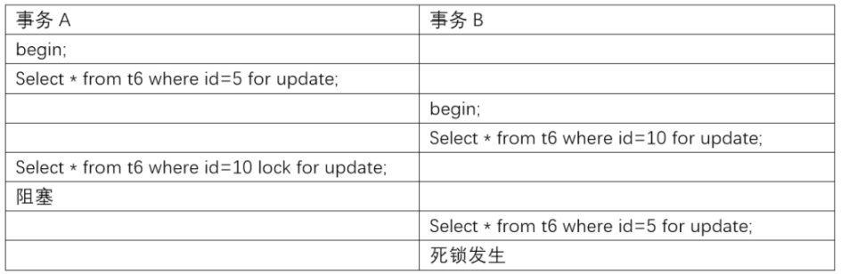
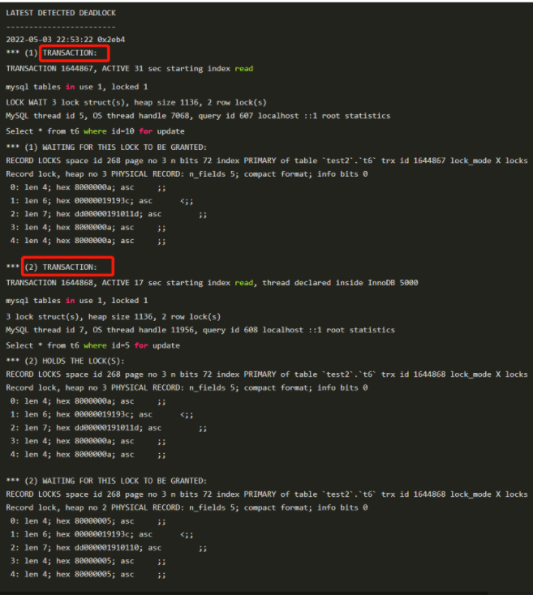
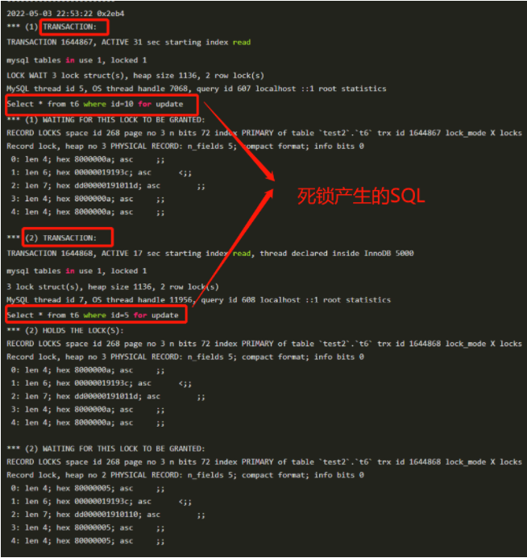
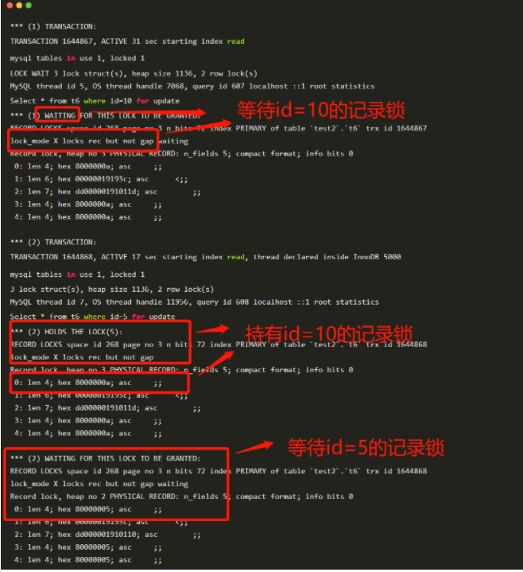

# 一、Innodb 锁分类
## Innodb 的七种锁介绍


1. 共享/排他锁
   
    InnoDB呢实现了两种标准的行级锁：共享锁（简称S锁）、排他锁（简称X锁）。
   
   + 共享锁：简称为S锁，在事务要读取一条记录时，需要先获取该记录的S锁。
   + 排他锁：简称X锁，在事务需要改动一条记录时，需要先获取该记录的X锁。
- - -
S锁和X锁的兼容关系如下图表格：

|锁类型 |S|X|
|-----:|-------:|:-------:|
|S     |兼容     |不兼容   |
|X     |不兼容   |不兼容   |

---


>X锁和S锁是对于行记录来说的话，因此可以称它们为行级锁或者行锁。我们认为行锁的粒度就比较细，其实一个事务也可以在表级别下加锁，对应的，我们称之为表锁。给表加的锁，也是可以分为X锁和S锁的哈。
   
   
- - -
   
2. 意向锁
   
   意向锁是一种不与行级锁冲突的表级锁。未来的某个时刻，事务可能要加共享或者排它锁时，先提前声明一个意向。注意一下，意向锁，是一个表级别的锁哈。

   >因为InnoDB是支持表锁和行锁共存的，如果一个事务A获取到某一行的排他锁，并未提交，这时候事务B请求获取同一个表的表共享锁。因为共享锁和排他锁是互斥的，因此事务B想对这个表加共享锁时，需要保证没有其他事务持有这个表的表排他锁，同时还要保证没有其他事务持有表中任意一行的排他锁。

   >然后问题来了，你要保证没有其他事务持有表中任意一行的排他锁的话，去遍历每一行？这样显然是一个效率很差的做法。为了解决这个问题，InnoDB的设计大叔提出了意向锁。

    意向锁分为两类：

   + 意向共享锁：简称IS锁，当事务准备在某些记录上加S锁时，需要现在表级别加一个IS锁。
   + 意向排他锁：简称IX锁，当事务准备在某条记录上加上X锁时，需要现在表级别加一个IX锁。
  
    比如：
    + select ... lock in share mode，要给表设置IS锁;
    + select ... for update，要给表设置IX锁;
  
    >如果一个事务A获取到某一行的排他锁，并未提交,这时候表上就有意向排他锁和这一行的排他锁。这时候事务B想要获取这个表的共享锁，此时因为检测到事务A持有了表的意向排他锁，因此事务A必然持有某些行的排他锁，也就是说事务B对表的加锁请求需要阻塞等待，不再需要去检测表的每一行数据是否存在排他锁啦。这样效率就高很多啦。

意向锁仅仅表明意向的锁，意向锁之间并不会互斥，是可以并行的，整体兼容性如下图所示：
这里所示的S、X 锁指的是表锁

|锁类型 |IS|IX|S|X|
|----- |-------:|-------:|-------:|:-------:|
|IS|兼容|兼容|兼容|不兼容|
|IX|兼容|兼容|不兼容|不兼容|
|S |兼容|不兼容|兼容|不兼容|
|X |不兼容|不兼容|不兼容|不兼容|

- - -

3. 记录锁(Record Lock)
   
   记录锁是最简单的行锁，仅仅锁住一行。如：SELECT c1 FROM t WHERE c1 = 10 FOR UPDATE，如果c1字段是主键或者是唯一索引的话，这个SQL会加一个记录锁（Record Lock）

   记录锁永远都是加在索引上的，即使一个表没有索引，InnoDB也会隐式的创建一个索引，并使用这个索引实施记录锁。它会阻塞其他事务对这行记录的插入、更新、删除。

   一般我们看死锁日志时，都是找关键词，比如lock_mode X locks rec but not gap），就表示一个X型的记录锁。记录锁的关键词就是rec but not gap。以下就是一个记录锁的日志：
    ```
    RECORD LOCKS space id 58 page no 3 n bits 72 index `PRIMARY` of table `test`.`t` 
    trx id 10078 lock_mode X locks rec but not gap
    Record lock, heap no 2 PHYSICAL RECORD: n_fields 3; compact format; info bits 0
    0: len 4; hex 8000000a; asc     ;;
    1: len 6; hex 00000000274f; asc     'O;;
    2: len 7; hex b60000019d0110; asc        ;;
    ```
- - -
4. 间隙锁(Gap Lock)
   
   为了解决幻读问题，InnoDB引入了间隙锁(Gap Lock)。间隙锁是一种加在两个索引之间的锁，或者加在第一个索引之前，或最后一个索引之后的间隙。它锁住的是一个区间，而不仅仅是这个区间中的每一条数据。

   比如lock_mode X locks gap before rec表示X型gap锁。以下就是一个间隙锁的日志：
   ```
   RECORD LOCKS space id 177 page no 4 n bits 80 index idx_name of table `test2`.`account` 
    trx id 38049 lock_mode X locks gap before rec
    Record lock, heap no 6 PHYSICAL RECORD: n_fields 2; compact format; info bits 0
    0: len 3; hex 576569; asc Wei;;
    1: len 4; hex 80000002; asc     ;;
   ```
- - -
5. 临键锁(Next-Key Lock)
   
   Next-key锁是记录锁和间隙锁的组合，它指的是加在某条记录以及这条记录前面间隙上的锁。说得更具体一点就是:临键锁会封锁索引记录本身，以及索引记录之前的区间，即它的锁区间是前开后闭，比如(5,10]。

   如果一个会话占有了索引记录R的共享/排他锁，其他会话不能立刻在R之前的区间插入新的索引记录。官网是这么描述的：
   >If one session has a shared or exclusive lock on record R in an index, another session cannot insert a new index record in the gap immediately before R in the index order.
- - -
6. 插入意向锁
    
    插入意向锁,是插入一行记录操作之前设置的一种间隙锁。这个锁释放了一种插入方式的信号。它解决的问题是：多个事务，在同一个索引，同一个范围区间插入记录时，如果插入的位置不冲突，就不会阻塞彼此。

    假设有索引值4、7，几个不同的事务准备插入5、6，每个锁都在获得插入行的独占锁之前用插入意向锁各自锁住了4、7之间的间隙，但是不阻塞对方因为插入行不冲突。以下就是一个插入意向锁的日志：

    ```
    RECORD LOCKS space id 31 page no 3 n bits 72 index `PRIMARY` of table `test`.`child`
    trx id 8731 lock_mode X locks gap before rec insert intention waiting
    Record lock, heap no 3 PHYSICAL RECORD: n_fields 3; compact format; info bits 0
    0: len 4; hex 80000066; asc    f;;
    1: len 6; hex 000000002215; asc     " ;;
    2: len 7; hex 9000000172011c; asc     r  ;;...
    ```
    锁模式兼容矩阵（横向是已持有锁，纵向是正在请求的锁）如下：
    
- - -
7. 自增锁
   
    自增锁是一种特殊的表级别锁。它是专门针对AUTO_INCREMENT类型的列，对于这种列，如果表中新增数据时就会去持有自增锁。简言之，如果一个事务正在往表中插入记录，所有其他事务的插入必须等待，以便第一个事务插入的行，是连续的主键值。

    官方文档是这么描述的：
    >An AUTO-INC lock is a special table-level lock taken by transactions inserting into tables with AUTO_INCREMENT columns. In the simplest case, if one transaction is inserting values into the table, any other transactions must wait to do their own inserts into that table, so that rows inserted by the first transaction receive consecutive primary key values.

    参数控制：
    + 0：表示传统锁模式，使用表级AUTO_INC锁。一个事务的INSERT-LIKE语句在语句执行结束后释放AUTO_INC表级锁，而不是在事务结束后释放。
  
    + 1: 连续锁模式,连续锁模式对于Simple inserts不会使用表级锁，而是使用一个轻量级锁来生成自增值，因为InnoDB可以提前知道插入多少行数据。自增值生成阶段使用轻量级互斥锁来生成所有的值，而不是一直加锁直到插入完成。对于bulk inserts类语句使用AUTO_INC表级锁直到语句完成。

    + 2:交错锁模式,所有的INSERT-LIKE语句都不使用表级锁，而是使用轻量级互斥锁。
    
        >这个参数设置为1的时候，相当于将这种auto_inc lock弱化为了一个更轻量级的互斥自增长机制去实现，官方称之为mutex。

    插入类型分类：
    + INSERT-LIKE:指所有的插入语句，包括：INSERT、REPLACE、INSERT…SELECT、REPLACE…SELECT,LOAD DATA等。
    + Simple inserts:指在插入前就能确定插入行数的语句，包括：INSERT、REPLACE，不包含INSERT…ON DUPLICATE KEY UPDATE这类语句。
    + Bulk inserts: 指在插入钱不能确定行数的语句，包括：INSERT … SELECT/REPLACE … SELECT/LOAD DATA。

- - -

# 附录

+ innodb 状态输出
  
    通过以下操作，可以使锁信息在 show engine innodb status\G 中显示
```
SET GLOBAL innodb_status_output=ON; -- 开启输出
SET GLOBAL innodb_status_output_locks=ON; -- 开启锁信息输出
SHOW ENGINE INNODB STATUS
```
- - -
+ innodb_locks_unsafe_for_binlog 参数设置
  innodb_locks_unsafe_for_binlog最主要的作用就是控制innodb是否对gap加锁。
  需要深入研究（8.0 此参数废弃）
---
+ 如何查看事务加锁情况

    + 使用infomation_schema数据库中的表获取锁信息
    + 使用show engine innodb status 命令
  
+ information_schema
    + INNODB_TRX：该表存储了InnoDB当前正在执行的事务信息，包括事务id、事务状态（比如事务是在运行还是在等待获取某个锁）等。
    + INNODB_LOCKS：该表记录了一些锁信息，包括两个方面：1.如果一个事务想要获取某个锁，但未获取到，则记录该锁信息。2. 如果一个事务获取到了某个锁，但是这个锁阻塞了别的事务，则记录该锁信息。
    + INNODB_LOCK_WAITS:表明每个阻塞的事务是因为获取不到哪个事务持有的锁而阻塞。
+ show engine innodb status\G
    + lock_mode X locks gap before rec表示X型的gap锁
    + lock_mode X locks rec but not gap表示 X型的记录锁（Record Lock）
    + lock mode X 一般表示 X型临键锁（next-key 锁）
    >innodb_status_output_locks 一般打开此参数，这个锁的详细信息会在 show engine innodb status 中显示.

>INNODB_LOCKS 和 INNODB_LOCK_WAITS 在MySQL 8.0已被移除，其实就是不鼓励我们用这两个表来获取表信息。而我们还可以用show engine innodb status获取当前系统各个事务的加锁信息。
- - - 
+ 死锁分析案例

>当并发系统中不同线程出现循环资源依赖，涉及的线程都在等待别的线程释放资源时，就会导致这几个线程都进入无限等待的状态，称为死锁。

控制死锁的两个策略
  + 一种策略是，直接进入等待，直到超时。这个超时时间可以通过参数                 innodb_lock_wait_timeout 来设置。(不宜设置过小，容易误伤行锁)
  + 另一种策略是，发起死锁检测，发现死锁后，主动回滚死锁链条中的某一个事务，让其他事务得以继续执行。将参数 innodb_deadlock_detect 设置为 on，表示开启这个逻辑。
   >频繁的死锁检查可能会消耗大量的CPU资源，当某些热点行频繁进行死锁检测时可能造成系统CPU飙高，吞吐并不高的情况.


    [死锁案例](https://mp.weixin.qq.com/s/FwtMWBT_GBH2cSgod2oUzA)
    
    如果发生死锁了，我们应该如何分析呢？一般分为四个步骤：

    1. show engine innodb status，查看最近一次死锁日志。
    2. 分析死锁日志，找到关键词TRANSACTION
    3. 分析死锁日志，查看正在执行的SQL
    4. 看SQL持有什么锁，又在等待什么锁。
   
   - - -

   + 一个死锁的简单例子
   表结构和数据如下：
   ```
   CREATE TABLE t6 ( id int(11) NOT NULL, c int(11) DEFAULT NULL, d int(11) DEFAULT NULL, PRIMARY KEY (id), KEY c (c)) ENGINE=InnoDB;
   insert into t6 values(5,5,5),(10,10,10);
   ```
   我们开启A、B事务，执行流程如下：
   

   分析死锁日志
   1. show innodb status，查看最近一次死锁日志。如下：
   ```
    ------------------------
    LATEST DETECTED DEADLOCK
    ------------------------
    2022-05-03 22:53:22 0x2eb4
    *** (1) TRANSACTION:
    TRANSACTION 1644867, ACTIVE 31 sec starting index read
    mysql tables in use 1, locked 1
    LOCK WAIT 3 lock struct(s), heap size 1136, 2 row lock(s)
    MySQL thread id 5, OS thread handle 7068, query id 607 localhost ::1 root   statistics
    Select * from t6 where id=10 for update
    *** (1) WAITING FOR THIS LOCK TO BE GRANTED:
    RECORD LOCKS space id 268 page no 3 n bits 72 index PRIMARY of table `test2`.   `t6` trx id 1644867 lock_mode X locks rec but not gap waiting
    Record lock, heap no 3 PHYSICAL RECORD: n_fields 5; compact format; info bits 0
     0: len 4; hex 8000000a; asc     ;;
     1: len 6; hex 00000019193c; asc      <;;
     2: len 7; hex dd00000191011d; asc        ;;
     3: len 4; hex 8000000a; asc     ;;
     4: len 4; hex 8000000a; asc     ;;

    *** (2) TRANSACTION:
    TRANSACTION 1644868, ACTIVE 17 sec starting index read, thread declared inside  InnoDB 5000
    mysql tables in use 1, locked 1
    3 lock struct(s), heap size 1136, 2 row lock(s)
    MySQL thread id 7, OS thread handle 11956, query id 608 localhost ::1 root  statistics
    Select * from t6 where id=5 for update
    *** (2) HOLDS THE LOCK(S):
    RECORD LOCKS space id 268 page no 3 n bits 72 index PRIMARY of table `test2`.   `t6` trx id 1644868 lock_mode X locks rec but not gap
    Record lock, heap no 3 PHYSICAL RECORD: n_fields 5; compact format; info bits 0
     0: len 4; hex 8000000a; asc     ;;
     1: len 6; hex 00000019193c; asc      <;;
     2: len 7; hex dd00000191011d; asc        ;;
     3: len 4; hex 8000000a; asc     ;;
     4: len 4; hex 8000000a; asc     ;;

    *** (2) WAITING FOR THIS LOCK TO BE GRANTED:
    RECORD LOCKS space id 268 page no 3 n bits 72 index PRIMARY of table `test2`.   `t6` trx id 1644868 lock_mode X locks rec but not gap waiting
    Record lock, heap no 2 PHYSICAL RECORD: n_fields 5; compact format; info bits 0
     0: len 4; hex 80000005; asc     ;;
     1: len 6; hex 00000019193c; asc      <;;
     2: len 7; hex dd000001910110; asc        ;;
     3: len 4; hex 80000005; asc     ;;
     4: len 4; hex 80000005; asc     ;;
   ```
   1. 先找到关键词TRANSACTION，可以发现两部分的事务日志，如下：
   
   1. 查看正在执行，产生死锁的对应的SQL，如下：
   
   1. 查看分开两部分的TRANSACTION，分别持有什么锁，和等待什么锁。
    

    >所谓的死锁，其实就是，我持有你的需要的锁，你持有我需要的锁，形成相互等待的闭环。所以排查死锁问题时，照着这个思维去思考就好啦。

    - - -
+ 本文参考
  [参考链接](https://mp.weixin.qq.com/s/FwtMWBT_GBH2cSgod2oUzA)
  [参考链接](https://zhuanlan.zhihu.com/p/569570307)

  [参考链接](https://mp.weixin.qq.com/s/jFRgAHUo7zM8RUezXTOZeQ)