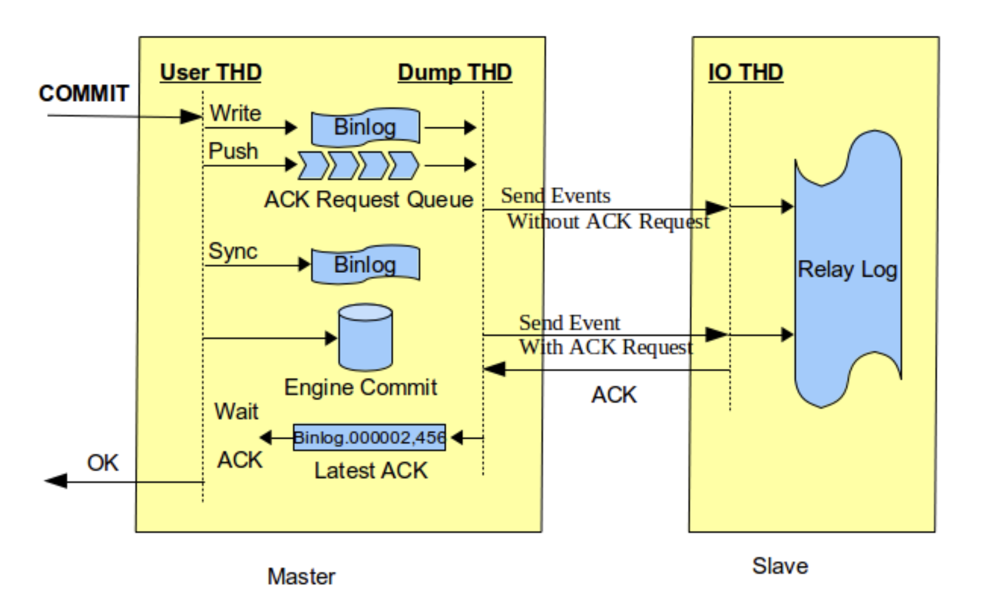
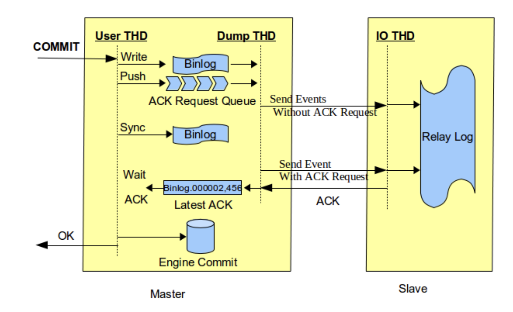
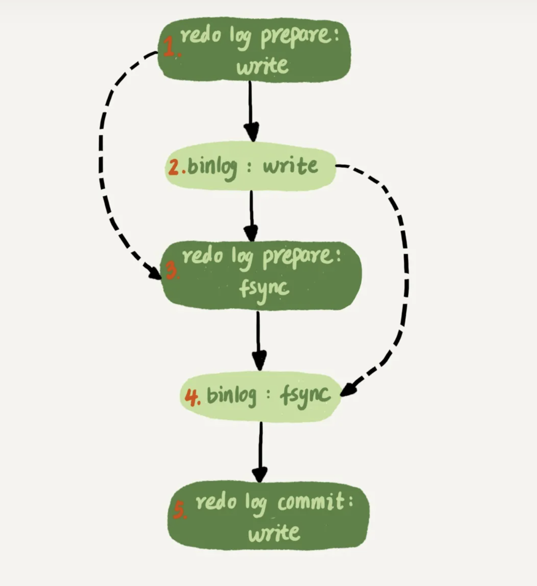
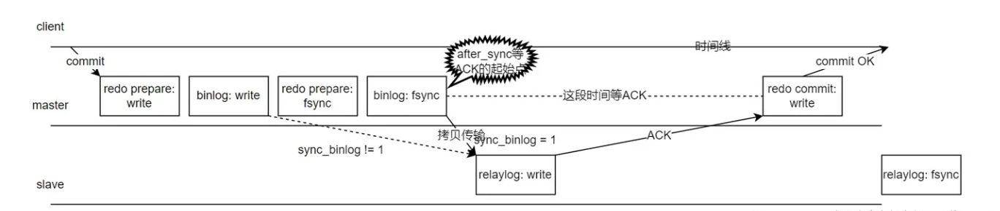
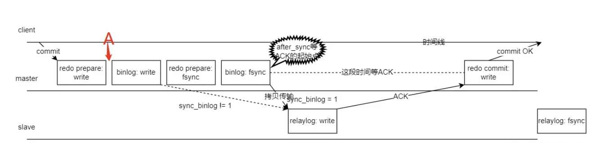
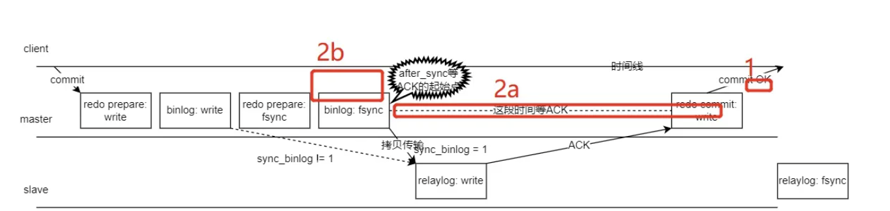
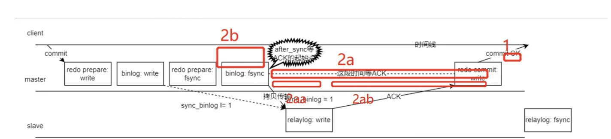
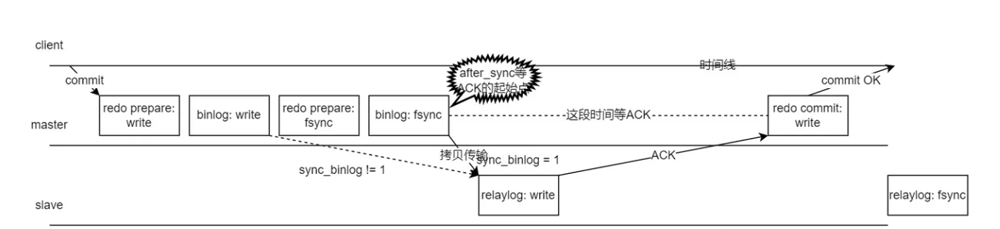

# MySQL 半同步

## 普通半同步  after_commit

engine commit 在接收到从库返回的ack 之前,主库崩溃后从库接管可能出现幻读现象(原主库能看到的数据在新主库上无法看到),从库没有接收到相关数据,存在数据丢失的可能.

## 增强半同步  after_sync

主库先接收到 ack后才进行engine commit，主库宕机不会导致从库丢失事务信息。但也会存在部分可能原主库恢复后通过内部xa 机制(binlog+redo) 恢复出未提交完成的事务。(不过和after_commit 不同的是，崩溃前这个事务对业务并不可见，不影响业务一致性。通常可以将这个旧主库该条事务回滚。)

## 增强半同步旧主多数据场景分析

#### redo log 和binlog 内部xa

主从同步详细流程

+ 图中只关注 binlog、redo、relaylog 三个文件写入和刷盘行为。
+ 图中 write 代表写入文件，对于 Linux 系统一般就是写入到 OS 的 page cache 了。这个时候服务器发生 crash，日志数据将丢失。
+ 图中 fsync 代表 MySQL 调用 Linux 的 fsync 把 page cache 持久化到磁盘，我们称之为"刷盘"。
+ sync_binlog 设置不一样，MySQL 的 dump binlog 线程工作的起始点会不一样，我们本文用的是传说中最安全的双一设置，所以sync_binlog=1，从库到主库拉去 binlog 的时间点发生在binlog: fsync后。

步骤解读：
1. 用户在 client 处执行 commit 提交了事务，主库写入了 redo 文件，对应"redo prepare: write"
2. binlog: write—— master 节点写入 binlog 文件。
3. redo prepare: fsync—— 传说中的两阶段提交的第一阶段 prepare 刷盘(从 OS 层 page cache 持久化刷新到硬盘)了。
4. binlog: fsync—— binlog 刷盘。
5. 拷贝 binlog 到 slave 写入到 relaylog 文件，写完则返回 ACK 给 master 节点，表示收到这个 binlog 了，relaylog 根据参数sync_relay_log=10000每 10000 个事务刷一次刷盘(因为我们只讨论主库 crash 的情况，这个从库 relay 刷盘行为我们不用管)
6. 根据参数设置rpl_semi_sync_master_wait_point=AFTER_SYNC，所以在这个位置点开始等待 slave 节点完成"relaylog: write"，然后返回个 ACK 给 master。
7. master 节点收到 ACK 后，知道从库收到这个 binlog 后就可以提交事务了，发起"redo commit：write"，传说中的两阶段提交的第二阶段 commit 阶段，commit 到文件。
8. master 回复客户端 ACK: commit OK。

### 故障场景分析
#### 场景一  binlog 写入前

如果在A时刻，也就是redo log 处于 prepare阶段之后、写binlog 之前，发生了 crash，由于此时binlog还没有写入，redo log 未提交，所以崩溃恢复时这个事务会回滚。同时，这个事务还没有同步到备库，不会存在数据丢失或多余。

#### 场景二 binlog 写入后，redo commit 前

崩溃恢复规则：
1.  如果redo log 里面的事务是完整的，已经存在commit 标识，则直接提交
2.  如果redo log 里面的事务只有prepare，则判断对应的事务binlog 是否存在并完整：
    1.  如果完整，则提交事务
    2.  如果不完整，则回滚事务

+ 2b 阶段，binlog 未写入成功，未同步到从库，且崩溃后会回滚此事务，所以该阶段是安全的。
+ 2a 阶段，有可以分为 2aa relay log 写入阶段，2ab 返回ack 阶段
  + 2aa 阶段 relay log没有写入，主库崩溃恢复后会多事务
  + 2ab 阶段 relay log写入成功了，只是没有返回ack 给主库，这时认为从库和主库数据是一致的

### 高可用切换逻辑
+ 补数，补数适用于将旧主多余的数据应用到新主，不过只适用于新主提供业务服务之前。如果新主提供服务后再进行补数，则有可能造成数据不一致
+ 闪回，将旧主多余的事务回滚，回滚的这部分事务并没有给业务返回提交成功，回滚后，旧主就可以和新主数据保持一致

### 扩展：新主多事务情况
sync_binlog 参数影响同步binlog 的起点
+ sync_binlog=1 该情况下不会出现，从库到主库拉去 binlog 的时间点发生在binlog: fsync（写磁盘）后
+ sync_binlog !=1 有可能出现新主多事务的情况，从库到主库拉去 binlog 的时间点发生在binlog: write（写缓存）后
  + binlog 不是每次事务都刷盘，主库挂了后，丢失一些事务。
  + 即使每次刷盘也没用，因为 dump binlog 起始位置不一样，如果主库挂载在写入 binlog 后，网速很快完成传输到从库，但 binlog 还没有来得及 fsync 这种极限情况下发生了 crash，还是会导致主库丢失了这些 binlog，而从库承认了这些 binlog。  

参考图:

