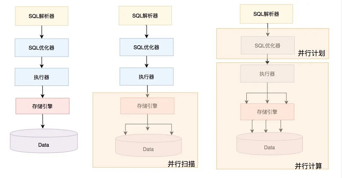
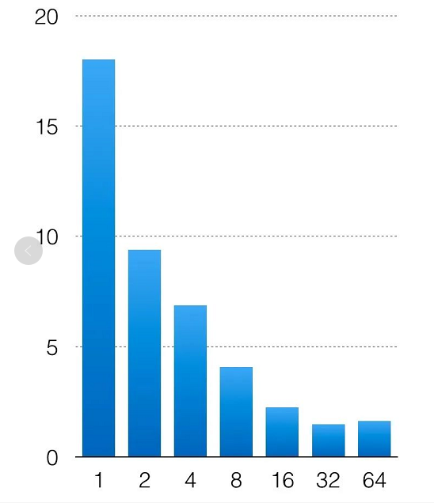

# MySQL 新特性

- - -

## InnoDB 并行查询
>MySQL 8.0.14 版本第一次引入了并行查询特性，使得check table和select count(*) 类型的语句性能成倍提升,但目前使用场景还比较有限。

>从 MySQL 8.0.14 开始，InnoDB支持并行聚集索引读取，可以提高 CHECK TABLE性能。此功能不适用于二级索引扫描。innodb_parallel_read_threads 会话变量必须设置为大于 1 的值才能进行并行聚集索引读取。 默认值为 4。用于执行并行聚集索引读取的实际线程数由 innodb_parallel_read_threads 设置或要扫描的索引子树的数量决定，以较小者为准。
1. 使用方式
   
    通过配置参数 innodb_parallel_read_threads 来设置并发线程数，就能开始并行扫描功能.

2. 并行执行现状
    实际上目前 MySQL 的并行执行还处于非常初级阶段，如下图所示，左边是之前MySQL串行处理单个SQL形态；中间的是目前MySQL版本提供的并行能力，InnoDB引擎并行扫描的形态；最右边的是未来MySQL要发展的形态，优化器根据系统负载和SQL生成并行计划，并将分区计划下发给执行器并行执行。并行执行不仅仅是并行扫描，还包括并行聚集，并行连接，并行分组，以及并行排序等。目前版本MySQL的上层的优化器以及执行器并没有配套的修改。因此，下文的讨论主要集中在InnoDB引擎如何实现并行扫描，主要包括分区，并行扫描，预读以及与执行器交互的适配器类。
    
3. 分区
    并行扫描的一个核心步骤就是分区，将扫描的数据划分成多份，让多个线程并行扫描。InnoDB引擎是索引组织表，数据以B+tree的形式存储在磁盘上，节点的单位是页面(block/page)，同时缓冲池中会对热点页面进行缓存，并通过LRU算法进行淘汰。分区的逻辑就是，从根节点页面出发，逐层往下扫描，当判断某一层的分支数超过了配置的线程数，则停止拆分。在实现时，实际上总共会进行两次分区，第一次是按根节点页的分支数划分分区，每个分支的最左叶子节点的记录为左下界，并将这个记录记为相邻上一个分支的右上界。通过这种方式，将B+tree划分成若干子树，每个子树就是一个扫描分区。经过第一次分区后，可能出现分区数不能充分利用多核问题，比如配置了并行扫描线程为3，第一次分区后，产生了4个分区，那么前3个分区并行做完后，第4个分区至多只有一个线程扫描，最终效果就是不能充分利用多核资源。

4.二次分区

   为了解决这个问题，8.0.17版本引入了二次分区，对于第4个分区，继续下探拆分，这样多个子分区又能并发扫描，InnoDB引擎并发扫描的最小粒度是页面级别。具体判断二次分区的逻辑是，一次分区后，若分区数大于线程数，则编号大于线程数的分区，需要继续进行二次分区；若分区数小于线程数且B+tree层次很深，则所有的分区都需要进行二次分区。相关代码如下

    ```
    split_point = 0;
    if (ranges.size() > max_threads()) {
        //最后一批分区进行二次分区                                      
        split_point = (ranges.size() / max_threads()) * max_threads();          
    } else if (m_depth < SPLIT_THRESHOLD) 
    {                                  
        /* If the tree is not very deep then don't split. For smaller tables    
       it is more expensive to split because we end up traversing more blocks*/
       split_point = max_threads();                                            
     } else {
       //如果B+tree的层次很深(层数大于或等于3，数据量很大)，则所有分区都需要进行二次分区
     }
    ```
无论是一次分区，还是二次分区，分区边界的逻辑都一样，以每个分区的最左叶子节点的记录为左下界，并且将这个记录记为相邻上一个分支的右上界。这样确保分区足够多，粒度足够细，充分并行。下图展示了配置为3的并发线程，扫描进行二次分区的情况。
    
+ 实验
  通过sysbench导入2亿条数据，分别配置 innodb_parallel_read_threads 为1，2，4，8，16，32，64，测试并行执行的效果。测试语句为

    `select count(*) from sbtest1;`
    
    >横轴是配置并发线程数，纵轴是语句执行时间。从测试结果来看，整个并行表现还是不错的，扫描2亿条记录，从单线程的18s，下降到32线程的1s。后面并发开再多，由于数据量有限，多线程的管理消耗超过了并发带来的性能提升，不能再继续缩短SQL执行时间。

+ 参考地址
  [https://mp.weixin.qq.com/s/tDyJ5heUu6Q0WObpRHrq2A](https://mp.weixin.qq.com/s/tDyJ5heUu6Q0WObpRHrq2A)


- - -
## 序列化字典信息 (SDI) 

>Serialized dictionary information (SDI) is present in all InnoDB tablespace files except for global temporary tablespace and undo tablespace files. SDI is serialized metadata for table and tablespace objects. The presence of SDI data provides metadata redundancy. For example, dictionary object metadata may be extracted from tablespace files if the data dictionary becomes unavailable. SDI extraction is performed using the ibd2sdi tool. SDI data is stored in JSON format.

8.0 不再使用frm 文件作为表定义文件，而是统一使用 sdi 文件存储表定义的元数据信息.通过mysql 提供了 ibd2sdi 工具提取表空间 sdi 信息并以JSON 格式显示.

- - -
## Innodb 临时表
+ 从 MySQL 8.0.13 开始，用户创建的临时表和优化器创建的内部临时表存储在会话临时表空间中，这些临时表空间从临时表空间池中分配给会话。当会话断开连接时，其临时表空间将被truncate并释放回池中。在以前的版本中，临时表是在全局临时表空间 ( ibtmp1) 中创建的，在删除临时表后不会将磁盘空间返回给操作系统。
+ innodb_temp_tablespaces_dir 变量定义了创建会话临时表空间的位置。默认位置是 #innodb_temp数据目录中的目录。
+ INNODB_SESSION_TEMP_TABLESPACES 表提供有关会话临时表空间的元数据
  
>As of MySQL 8.0.13, user-created temporary tables and internal temporary tables created by the optimizer are stored in session temporary tablespaces that are allocated to a session from a pool of temporary tablespaces. When a session disconnects, its temporary tablespaces are truncated and released back to the pool. In previous releases, temporary tables were created in the global temporary tablespace (ibtmp1), which did not return disk space to the operating system after temporary tables were dropped.

## 重做日志开关
从 MySQL 8.0.21 开始，可以使用 `ALTER INSTANCE {ENABLE|DISABLE} INNODB REDO_LOG `语法启用和禁用重做日志记录。此功能旨在将数据加载到新的 MySQL 实例中。禁用重做日志有助于通过避免重做日志写入来加速数据加载。

+ The new INNODB_REDO_LOG_ENABLE privilege permits enabling and disabling redo logging.

+ The new Innodb_redo_log_enabled status variable permits monitoring redo logging status.

- - -