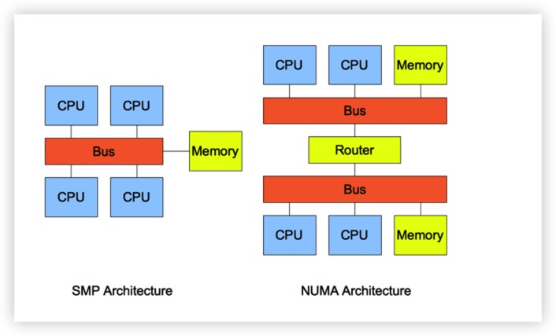
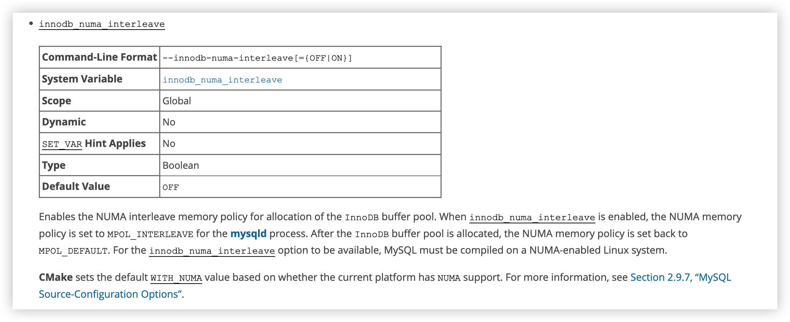

# Numa 问题

## 一、Numa
NUMA（Non-Uniform Memory Access，非一致性内存访问） NUMA 服务器的基本特征是 Linux 将系统的硬件资源划分为多个软件抽象，称为节点（Node），每个节点上有单独的 CPU、内存和 I/O 槽口等。CPU 访问自身 Node 内存的速度将远远高于访问远端内存（系统内其它节点的内存）的速度，这也是非一致内存访问 NUMA 的由来。

非一致存储访问结构 (NUMA ： Non-Uniform Memory Access) 也是最新的内存管理技术。它和对称多处理器结构 (SMP ： Symmetric Multi-Processor) 是对应的。简单的队别如图：



## 二、Numa 内存分配策略

+ 缺省（default）：总是在本地节点分配（当前进程运行的节点上）
+ 绑定（bind）：强制分配到指定节点上
+ 交叉（interleavel）：在所有节点或者指定节点上交叉分配内存
+ 优先（preferred）：在指定节点上分配，失败则在其他节点上分配


## 三、Numa 配置

### 3.1.监测Numa
1. 查看BIOS 层面是否开启
    ```
    #启用NUMA后的显示
    [root@cm ~]# grep -i numa /var/log/dmesg
    NUMA: Using 31 for the hash shift.
    pci_bus 0000:00: on NUMA node 0
    pci_bus 0000:80: on NUMA node 1

    #关闭NUMA后的显示
    [root@cm ~]# grep -i numa /var/log/dmesg
    No NUMA configuration found
    pci_bus 0000:00: on NUMA node 0
    pci_bus 0000:80: on NUMA node 0
    ```

2. 系统层面查看Numa 是否开启
    ```
    [root@cm ~]# numactl --hardware  (numactl -H)
    available: 2 nodes (0-1)
    #当 available 数量大于1 时，说明系统开启了numa
    node 0 cpus: 0 1 2 3 4 5 6 7 16 17 18 19 20 21 22 23
    node 0 size: 16259 MB
    node 0 free: 2781 MB
    node 1 cpus: 8 9 10 11 12 13 14 15 24 25 26 27 28 29 30 31
    node 1 size: 16384 MB
    node 1 free: 956 MB
    node distances:
    node   0   1
      0:  10  21
      1:  21  10
    ```

    > 同时，如果开启还可以观察每个numa node 上的内存分配及占用情况

3. 查看各numa node 内存使用情况
    ```
    [greatdb@ndka0106 ~]$ numastat -c

    Per-node numastat info (in MBs):
                        Node 0     Node 1      Total
                    ---------- ---------- ----------
    Numa_Hit        1371490167 1479931742 2851421909
    Numa_Miss        285630806   88440978  374071784
    Numa_Foreign      88440978  285630806  374071784
    Interleave_Hit         437        438        875
    Local_Node      1371502617 1479941481 2851444097
    Other_Node       285618356   88431240  374049596
    ```
4. 查看进程在 numa node 内存分配情况
    ```
    [greatdb@ndka0106 ~]$ numastat -p 17039

    Per-node process memory usage (in MBs) for PID 17039    (greatdbd)
                               Node 0          Node 1               Total
                      --------------- ---------------   ---------------
    Huge                         0.00            0.00               0.00
    Heap                         0.00            0.00               0.00
    Stack                     1836.20        75539.77           77375.96
    Private                     53.08          250.22           303.30
    ----------------  --------------- ---------------   ---------------
    Total                     1889.28        75789.99           77679.27
    ```

### 3.2.关闭numa
1. BIOS 层面关闭

    在BIOS里找到Node Interleaving（一般在Memory setting）
    + 当设置为Disabled：表示启用NUMA，非一致访问方式访问，这是默认配置。
    + 当设置为Enabled：表示smp方式启用内存交错模式，smp的方式，关闭NUMA。

2. 系统层面关闭
   
    For RHEL/Centos 7：
    编辑 /etc/default/grub 文件的 kernel 行

    ```
    # vi /etc/default/grub
    GRUB_CMDLINE_LINUX="rd.lvm.lv=rhel_vm-210/root rd.lvm.  lv=rhel_vm-210/swap vconsole.font=latarcyrheb-sun16   crashkernel=auto vconsole.keymap=us rhgb quiet numa=off

    RHEL7/CentOS7 必须要重建 GRUB 配置文件才能生效：

    # grub2-mkconfig -o /etc/grub2.cfg
    ```

   
3. mysqld 单独配置交叉分配策略
   在 mysqld_safe 脚本中加上 “numactl –interleave all” 来启动 mysqld。

    ` ./bin/mysqld_safe --defaults-file=/etc/my.cnf &`
   
### 3.3.注意点
硬件层面和软件层面关闭NUMA差距
+ 在os层numa关闭时,打开bios层的numa会影响性能，QPS会下降15-30%;
+ 在bios层面numa关闭时，无论os层面的numa是否打开，都不会影响性能。
>  资料显示，有待验证


## 四、Mysql与Numa

### 4.1.Mysql 参数
MySQL 在 5.6.27、 5.7.9 引入了 innodb_numa_interleave 参数，MySQL 自身解决了内存分类策略的问题，需要服务器支持且开启 numa。


> 当启用 innodb_numa_interleave 时，mysqld 进程的 NUMA 内存策略被设置为 MPOL_INTERLEAVE；InnoDB 缓冲池分配完毕后，NUMA 内存策略又被设置为 MPOL_DEFAULT。当然 innodb_numa_interleave 参数生效，MySQL 必须是在启用 NUMA 的 Linux 系统上编译安装。从 MySQL 5.7.17 开始，CMake 编译软件新增了 WITH_NUMA 参数，可以在支持 NUMA 的 Linux 系统上编译 MySQL。需要注意 innodb_numa_interleave 参数在 MySQL5.7.17 的二进制包中是不支持的。

>需要注意的是，此参数可能只会作用于innodb_buffer_pool的分配

### 4.2.Numa 对mysql 的影响
1. 关闭Numa
    + 显而易见，关闭Numa 特性则无法享受Numa带来的内存绑定给性能带来的提升，自然也能规避Numa 带来的一些负面的问题。

2. 开启Numa,使用默认配置
   + 使用默认配置的情况下，mysqld 进程默认绑定一个numa node，在此numa node 内存满足mysqld进程需求的情况下，这无疑会比关闭Numa 带来更好的使用体验，CPU 访问内存效率更高。
   + 然而受Numa限制，当默认numa node 内存不足以提供mysqld 进程使用时，则会使用到swap 空间，从而带来负面作用。

3. 开启Numa,设置内存分配策略为交叉分配或者配置innodb_numa_interleave=1
    + 使用`numactl --interleave=all` 方式启动mysql进程能够使用mysqld 交叉使用内存，不会出现系统内存充足但使用swap的情况，不过既然是交叉分配内存，那么也是无法充分利用Numa带来的益处，个人感觉和关闭Numa应该区别不大。
    + 配置innodb_numa_interleave=1 可以做到分配innodb_buffer_pool时使用交叉模式，其余内存包括线程内存还是绑定默认numa node 上。这样，如果其余内存的使用不超过默认numa node 可用内存应该是一个不错的优化方式。


### 4.3.优化与风险
1. 多实例场景下，如果单个numa node 内存满足单个mysql实例需求，那么绑定设置每个实例绑定不同numa 确实能够收获不错的效果。但是numa node 内存不能完全满足单个实例需求是，也不见得是个好的方式。
2. 如果开启numa，将网卡绑定到流量入口服务进程（中间件或者mysql 主节点）也有一定的性能提升。

### 4.4.使用建议
非多实例环境下，建议关闭Numa


## 五、实际场景问题分析

### 5.1.问题描述
现场环境遇到在mysql机器内存充足的情况下频繁使用swap 的情况，free -h 命令查看内存剩余30G+

### 5.2.问题分析
通过此现象，结合了解到的numa 相关特性，感觉这个现象和使用numa 只绑定了本地节点，而本地节点内存不足导致使用swap 的情况比较一致。

### 5.3.问题验证
`numactl --hardware`
执行上述命令，发现服务器是开启numa的，并且存在两个numa node，观察每个numa node 上的内存分配情况，发现两个numa node 各分配 128G内存，其中一个numa node 剩余512M 内存，另一个内存剩余30G+，这就印证了我们的猜想。

### 5.4.问题总结
NUMA 的内存分配策略对于进程来说，并不是乐观的。因为 NUMA 默认是使用 CPU 亲和的内存分配策略，即请求进程会从当前所处的 CPU 的 Node 请求分配内存。当某个需要消耗大量内存的进程耗尽了所处的 Node 的内存时，就会导致产生 swap，不会从远程 Node 分配内存，这就是 swap insanity 现象。

MySQL 数据库是单进程多线程的架构，在开启的 NUMA 服务器中，内存被分配到各 NUMA Node 上，而 MySQL 进程只能消耗所在节点的内存。所以在开启 NUMA 的服务器上，某些特殊场景中容易出现系统拥有空闲内存但发生 SWAP 导致性能问题的情况。


### 5.5.解决方案
+ 关闭numa
+ 启动命令指定numa 内存分配策略为交叉模式
    `numactl --interleave=all ./bin/mysqld_safe --defaults-file=/etc/my.cnf &`


## 六、遗留问题
1. 测试对比，BIOS、系统层面关闭Numa、开启Numa、开启Numa配置交叉分配、开启Numa设置mysql 参数等场景下的具体性能表现，当前没有测试资源所以未能测试。


内核参数zone_reclaim_mode：

可选值0、1

a、当某个节点可用内存不足时：
1、如果为0的话，那么系统会倾向于从其他节点分配内存

2、如果为1的话，那么系统会倾向于从本地节点回收Cache内存多数时候

b、Cache对性能很重要，所以0是一个更好的选择


## 参考链接
https://zhuanlan.zhihu.com/p/371184288
https://zhuanlan.zhihu.com/p/387117470