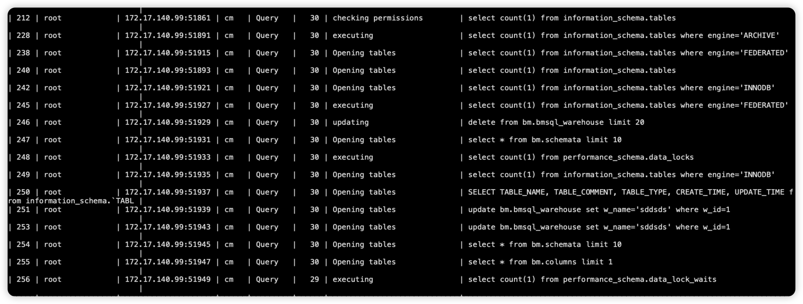

# 大事务和ps.data_locks data_lock_waits 冲突导致大量Opening table

## 问题描述
在大事务执行期间，频繁查询 performance_schema 下的 data_locks、data_lock_waits 表导致数据库夯住，阻塞业务请求，通过show processlist 查看到大量业务请求长时间处于 Opening table 状态。

## 问题复现

1. 开启大事务
   ```
   session 1
   begin;
   delete from bigtable where 1=1;
   ```
2. 并发随机执行如下语句
    ```
    update bm.bmsql_warehouse set w_name='sddsds' where w_id=1;
    insert into cm.a values(3,'sds',23);
    delete from bm.partitions limit 2;
    update bm.bmsql_warehouse set w_name='sddsds' where w_id=1;
    show global status
    SELECT @@gtid_executed, `Received_transaction_set` FROM `performance_schema`.`replication_connection_status` WHERE `Channel_name`=     'group_replication_applier' ;
    SELECT TABLE_NAME, TABLE_COMMENT, TABLE_TYPE, CREATE_TIME, UPDATE_TIME from information_schema.`TABLES` where table_schema =    'dmghost-dts-0e785305-3c49-4824-af2f-709517999b01-1' and TABLE_TYPE IN ('BASE TABLE', 'VIEW')
    SELECT TABLE_NAME, TABLE_COMMENT, TABLE_TYPE, CREATE_TIME, UPDATE_TIME from information_schema.`TABLES` where table_schema = 'cm' and   TABLE_TYPE IN ('BASE TABLE', 'VIEW')
    show global status
    select count(1) from information_schema.tables where engine='INNODB'
    select count(1) from information_schema.tables where engine='FEDERATED'
    select count(1) from information_schema.tables where engine='MyISAM'
    select count(1) from information_schema.tables where engine='ARCHIVE'
    select count(1) from information_schema.tables
    select count(1) from performance_schema.data_locks;
    select count(1) from performance_schema.data_lock_waits;
    ```
3. 通过show processlist 查看状态
   

## 处理思路
1. 尽量避免大事务的使用
2. 谨慎使用 data_locks，data_lock_waits 表监控
3. 遇到此类问题时可重点关注innodb_trx 表，开始时间早的事务和影响行数多的事务