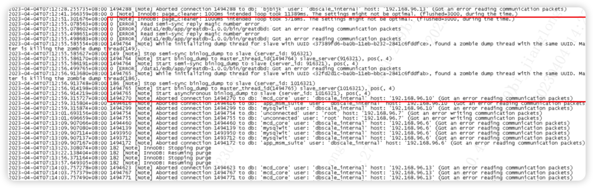
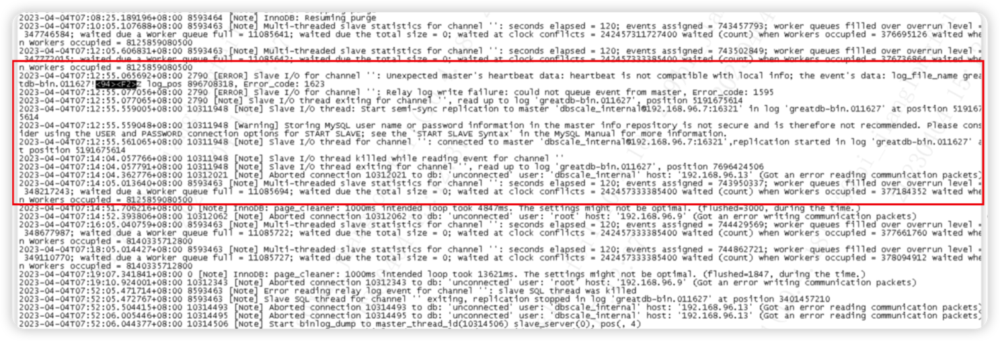

# MySQL BUG 101948

## 现象
大事务导致 Binlog 日志文件超过4G+，半同步复制异常中断，报错如下

主库

从库

## 问题分析

通过抓包分析，知道 binlog 传输的网络包里，next_position 只有 4 个字节，最大数值为 4G。
在 master 上做了一个超过 4G 的大事务，让 slave 从这个大事务后开始传输。此时 master 会发送一个心跳包。
心跳包中的 next_position 是 log event 在 binlog 位置，由于这个位置大于 4G，会被截断，导致 next_position 比实际的小。slave 收到心跳包，进行检测时发现 next_position 比实际的小，进行报错。

以上只是一种容易复现问题的场景。实际使用中，master 在一段时间不发送数据包后，或者特殊触发条件，都会发送心跳包。

对于一主多从的环境，每条复制链路的心跳是单独发送的，也就会导致多个 slave 的表现会有所不同，有的 slave 会触发报错，有的 slave 由于 master 没发送心跳包而不会触发报错。

## 参考链接 

https://zhuanlan.zhihu.com/p/338151665
https://bugs.mysql.com/bug.php?id=101948

## 问题规避 
核心思想，避免大事务
使用 my2sql  分析binlog 定位大事务，提交业务整改