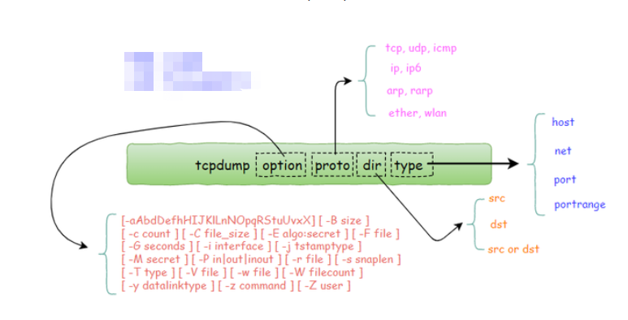
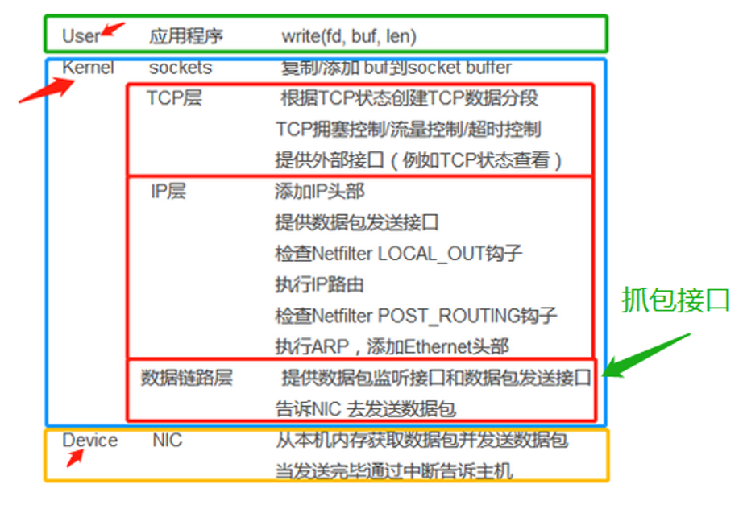
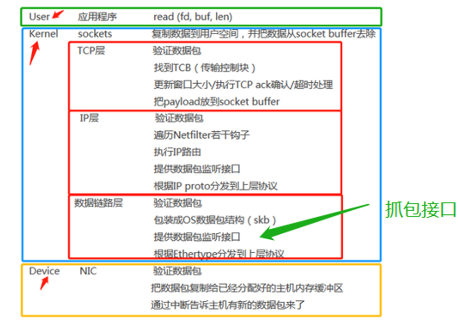

# Tcpdump
>tcpdump全称：dump the traffic on a network，根据使用者的定义对网络上的数据包进行截获的包分析工具。 tcpdump可以将网络中传送的数据包的“头”完全截获下来提供分析。它支持针对网络层、协议、主机、网络或端口的过滤，并提供and、or、not等逻辑语句来帮助你去掉无用的信息。
---

## 命令格式


## 万能抓包命令
```
tcpdump -i any tcp and port xxx -s yyy -w zzz.pcap -v
```
命令详解：
+ -i any   从所有网卡抓包(可以指定网卡名)
+ tcp      抓取tcp 类型的数据包
+ and      与(逻辑运算)
+ port xxx 获取端口为xxx 的应用数据包
+ -s yyy   设置抓包大小为yyy大小，一般在60~1500 范围，视情况而定
+ -w zzz.pcap 抓包数据文件名，pcap 方便wireshark 识别
+ -v       设置实时显示抓包状况
示例抓包3306 端口：
```
tcpdump -i any tcp and port 3306 -s 1500 -w zzz.pcap -v
```
---

## 使用pt 工具分析tcpdump 抓包

使用pt工具调试tcpdump抓包，分析sql语句执行效率的使用方法如下： 

+ 抓包方式 
```
tcpdump -s 65535 -x -nn -q -tttt -i any -c 100000 port 3306 > tcpdump_data.txt 
```

+ 下载pt工具percona-toolkit-3.3.1_x86_64.tar.gz 

+ 解压，使用./percona-toolkit-3.3.1/bin/pt-query-digest进行分析 
```
./percona-toolkit-3.3.1/bin/pt-query-digest --limit 95%:100 --type tcpdump tcpdump_data.txt  > result.txt 
```

>注意：如果抓包端口不是默认端口3306，按照以下步骤进行修改。 
(1)将第1步中的3306替换成指定端口，例如16310。 
(2)将第3步的pt-query-digest工具中的3306端口替换成指定端口，例如
```sed -i 's/3306/16310/g' pt-query-digest。``` 
此处修改是因为pt-query-digest的指定端口参数不生效，如果有找到办法欢迎反馈到万里DBA群里。 

# 附录

## 数据封包解包过程
+ 封包


+ 解包
  