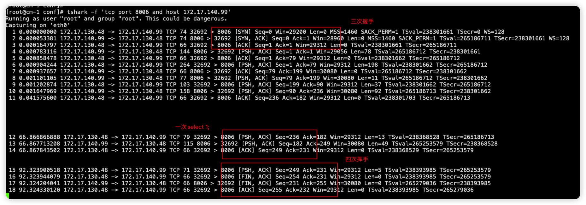

# MySQL 抓包分析利器 Tshark

>Wireshark 的命令行版本，也是一个开源的网络分析工具。它可以在命令行下捕获和分析网络流量数据，并使用 Wireshark 的过滤器来提取所需的数据，还支持与各种脚本语言（如 Python 和 Perl）结合使用，以自动化分析过程。

## 简单抓包

```
tshark -f 'tcp port 3332 and host 10.186.61.83'
```
> host 可以是源端也可以是目标端
> 此处省略了 -i，默认会选择第一个非 loopback 的网络接口（可简写为 lo），效果与指定 -i eth0 相同
> -f，指定捕获过滤器的表达式，可指定需要捕获的内容，如：协议、端口、主机IP等


## 常见用法示例

### tshark 以自定义字段来展示信息

```
tshark -i eth0 -d tcp.port==3332,mysql -f "host 10.186.61.83 and tcp port 3332" -T fields -e frame.time -e ip.host -e tcp.flags
```

> -T fields，可以指定需要输出的字段，需配合 -e 一起使用，此处将分别打印获取包的时间、主机 IP 及 TCP 的标志位，这些字段会按照 -e 的顺序进行排列展示
> -e，支持多种协议下的字段展示，具体用法查询路径：Wireshark -> 分析 -> 显示过滤器表达式

### tshark 抓取 MySQL 中执行的 SQL

> -Y，指定显示过滤器表达式，在单次分析中可以代替 -R 选项，此处表示仅显示 mysql.query 相关的包
> -d，用于指定该抓包会话的协议详细解析器模块，可以执行 tshark -d help 来查看可用的协议（执行虽然会报错，但会显示所有支持的协议），此处表示将 3332 端口上的TCP 包以 MySQL 协议进行解析
> -T fields -e mysql.query，即可获取符合 MySQL 协议的 SQL 语句
> -e ip.src -e ip.dst 的写法，也可以用 -e ip.host 来替换

```
tshark -f 'tcp port 8006' -Y "mysql.query" -d tcp.port==8006,mysql -T fields -e frame.time -e ip.src -e ip.dst -e mysql.query
```

```
过滤有效信息
tshark -i lo -d tcp.port==3332,mysql -Y 'mysql.query contains "show"' -T fields -e ip.host -e mysql.query -e frame.time -c 10
tshark -i lo -d tcp.port==3332,mysql -Y 'mysql.query matches "^show"' -T fields -e ip.host -e mysql.query -e frame.time -c 10
```
> contains 使用字符串进行匹配，只要在数据包中存在指定的字符串，就会匹配成功，不论该字符串出现在查询的任何位置
> matches 支持使用正则表达式进行匹配，匹配符合指定规则的数据包，如：^show
> 用 contains/maches 进行匹配查找时，关键词需用双引号包围，此时外层建议使用单引号，因为 maches 进行正则匹配时，外层使用双引号会报错，contains 则不限制
> 以上匹配方式类似模糊查询，但会区分大小写，如果指定 Show 或 SHOW 为关键词，可能获取不到 SQL

### tshark 抓包后用 Wireshark 解析
tshark 也可以像 tcpdump 一样，先在服务器上抓包，再拿到 Wireshark 的图形窗口中做进一步分析。

```
-- 抓取 50 个包并生成 pcap 文件
dmp2 (master) ~# tshark -d tcp.port==3332,mysql -f 'tcp port 3332 and host 10.186.61.83' -c 50 -w /tmp/61_83.pcap
Running as user "root" and group "root". This could be dangerous.
Capturing on 'eth0'

# 注意，-w 指定的文件无需提前创建，但抓包会话必须对该目录有写入权限，否则会报权限不足的错误。

```
同样地，也可以在 Wireshark 中将 mysql.query 字段展示出来：Wireshark -> 编辑 -> 首选项 -> 外观 -> 列 。


参考链接
https://juejin.cn/post/7244057643525570597
https://plantegg.github.io/2019/06/21/%E5%B0%B1%E6%98%AF%E8%A6%81%E4%BD%A0%E6%87%82%E6%8A%93%E5%8C%85--WireShark%E4%B9%8B%E5%91%BD%E4%BB%A4%E8%A1%8C%E7%89%88tshark/