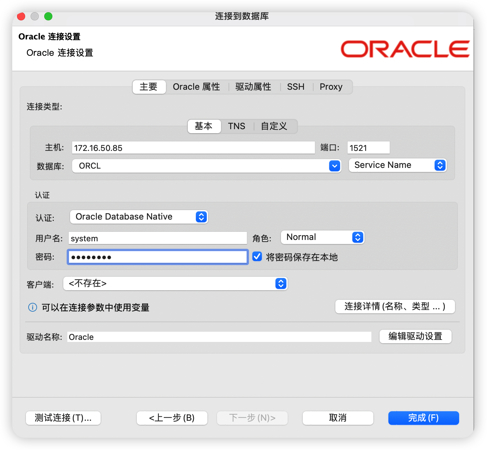

# Oracle 19c 安装

## 一.环境配置
### 1.下载Oracle 19c 安装包，并上传到Linux 系统中

### 2.修改hostname 和 hosts文件

```
hostnamectl set-hostname  cm-1
echo "IP地址    hostname"  >> /etc/hosts
```

### 3.安装依赖
> 依赖如下：
bc
binutils
compat-libcap1
compat-libstdc++-33
elfutils-libelf
elfutils-libelf-devel
fontconfig-devel
glibc-devel
ksh
libaio
libaio-devel
libX11
libXau
libXi
libXtst
libXrender
libXrender-devel
libgcc
libstdc++
libstdc++-devel
libxcb
make
smartmontools
sysstat

```
yum install -y bc binutils compat-libcap1 compat-libstdc++-33 elfutils-libelf elfutils-libelf-devel fontconfig-devel glibc-devel
yum install -y ksh libaio libaio-devel libX11 libXau libXi libXtst libXrender libXrender-devel libgcc libstdc++ libstdc++-devel libxcb make smartmontools sysstat
```

### 4.创建系统用户及组
```
groupadd oinstall
groupadd dba
groupadd asmdba
groupadd backupdba
groupadd dgdba
groupadd kmdba
groupadd racdba
groupadd oper
#添加用户并指定用户组
useradd -g oinstall -G dba,asmdba,backupdba,dgdba,kmdba,racdba,oper -m oracle
```
| | |
|:-------|:-------|
|oinstall|oracle清单组Oracle 软件所有者必须将 Oracle 清单组作为其主要组|
|dba|首次在系统上安装 Oracle 数据库软件时，必须创建此组。此组标识具有数据库管理特权 （特权） 的操作系统用户帐户。SYSDBA|
|oper|OSOPER 授予操作员启动和关闭数据库的权限（权限）。默认情况下，OSDBA 组的成员具有该特权授予的所有特权。SYSOPERSYSOPER|
|backupdba|用于 Oracle 数据库的操作系统备份数据库组（通常为：backupdba)如果希望一组单独的操作系统用户具有一组有限的数据库备份和恢复相关管理权限（SYSBACKUP 特权），请创建此组。|
|dgdba|适用于 Oracle 数据卫士的 OSDGDBA 组（通常为：dgdba)如果您希望一组单独的操作系统用户具有一组有限的权限来管理和监视 Oracle 数据卫士（SYSDG 权限），请创建此组。要使用此权限，请将 Oracle 数据库安装所有者添加为此组的成员。|
|kmdba|用于加密密钥管理的操作系统数据库数据库组（通常为：kmdba)如果您希望一组单独的操作系统用户具有一组有限的加密密钥管理权限（如 Oracle 钱包管理器管理（SYSKM 权限），请创建此组。要使用此权限，请将 Oracle 数据库安装所有者添加为此组的成员。|
|racdba|用于 Oracle 实际应用程序集群管理的 OSRACDBA 组（通常为：racdba)如果您希望一组单独的操作系统用户具有一组有限的 Oracle 实际应用程序集群 （RAC） 管理权限（SYSRAC 权限），请创建此组。要使用此权限：将 Oracle 数据库安装所有者添加为此组的成员。对于 Oracle 重新启动配置，如果您有单独的 Oracle 网格基础结构安装所有者用户 （），则还必须将该用户添加为数据库的 OSRACDBA 组的成员，以使 Oracle 网格基础结构组件能够连接到数据库。gridgrid|
|asmdba|asmdba的 OSDBA 在安装过程中，必须将一个组指定为用于 ASM 的 OSDBA 组。此组的成员被授予对 Oracle 自动存储管理的访问权限。|


### 5.目录创建
```
#包括home 目录
#oracle基目录
mkdir -p /oracle_soft/oracle/base
#oraclehome
mkdir -p /oracle_soft/oracle/base/product/19.3.0
# Location of the data file's
mkdir -p /oracle_soft/oracle/flash_recovery_area
mkdir -p /oracle_soft/oracle/oradata
#ORA_INVENTORY是当前操作系统上，Oracle相关软件的安装目录清单
mkdir -p /oracle_soft/oracle/orainventory

#基目录base/product/19.3.0/下面放置orcle安装包
```

### 6.修改内核参数 
```
vi /etc/sysctl.d/99-sysctl.conf
 
fs.aio-max-nr = 1048576
fs.file-max = 6815744
kernel.shmall = 2097152
kernel.shmmax = 4294967295
kernel.shmmni = 4096
kernel.sem = 250 32000 100 128
net.ipv4.ip_local_port_range = 9000 65500
net.core.rmem_default = 262144
net.core.rmem_max = 4194304
net.core.wmem_default = 262144
net.core.wmem_max = 1048576

使参数生效
sysctl -p 
```

### 7.添加环境变量
```
使用oracle用户操作

su - oracle
 
id
#看看 前面给的用户组对不
 
vi .bash_profile
 
在文件里面追加以下内容
 
# oracle_base 数据库目录结构的基目录
# ORACLE_HOME 表示ORACLE软件安装的目录
# ORACLE_SID ORACLE的SID，作用是用来区分同一台计算机上的同一个数据库的不同实例。
# #Oracle数据库的实例名
 
# ORACLE_TERM 指定安装Oracle终端的类型
# TNS_ADMIN 指定listener.ora tnsnames.ora的位置
# NLS_LANG 指定Client的字符集
# 以下是Linux的变量：
# LD_LIBRARY_PATH 设置临时的库文件的path路径
# PATH 设置搜索路径
# CLASSPATH 设置java lib文件搜索路径
# TMPDIR 临时目录
# set -o vi 默认的编辑器设置成vi
# umask 022 用来设置创建文件或目录的默认权限
 
export TMP=$HOME/tmp
export TMPDIR=$TMP
 
export ORACLE_BASE=/oracle_soft/oracle/base
export ORACLE_HOME=$ORACLE_BASE/product/19.3.0
export ORACLE_SID=orcl
export ORECLE_HOSTNAME=cm-1
export ORECLE_UNQNAME=orcl
 
export ORA_INVENTORY=/oracle_soft/oracle/orainventory
export PDB_NAME=pdb1
export DATA_DIR=/oracle_soft/oracle/oradata
#export LD_LIBRARY_PATH=$ORACLE_HOME/lib:$ORACLE_HOME/rdbms/lib:$ORACLE_HOME/network/lib:/lib:/usr/lib
export CLASSPATH=$ORACLE_HOME/JRE:$ORACLE_HOME/jlib:$ORACLE_HOME/rdbms/jlib
export LD_LIBRARY_PATH=$ORACLE_HOME/lib:/lib64:/usr/lib64:/usr/local/lib64
 
export NLS_LANG="SIMPLIFIED CHINESE_CHINA.AL32UTF8"
#export NLS_LANG="AMERICAN_AMERICA.AL32UTF8"
 
PATH=$PATH:$HOME/.local/bin:$HOME/bin:$ORACLE_HOME/bin
export PATH
 修改完毕后    source .bash_profile 

（需要中文的可以在/etc/profile 添加一个export LANG=zh_CN.utf8)
```

### 8.修改资源限制
```
vi /etc/security/limits.conf
  
oracle   soft   nofile    1024
oracle   hard   nofile    65536
oracle   soft   nproc    16384
oracle   hard   nproc    16384
oracle   soft   stack    10240
oracle   hard   stack    32768
oracle   hard   memlock    3145728
oracle   soft   memlock   3145728
```

## 二.安装Oracle
> 需要使用oracle 用户

### 1.创建目录并解压安装包
1. 上传zip压缩包到/oracle_soft/oracle/base/product/19.3.0
2. 直接把前面创建的/oracle_soft/oracle给oracle用户
    `sudo chown -R oracle:oinstall /oracle_soft/oracle`
3. 把oracle用户的家目录改成/data/soft/oracle
    `sudo usermod -d /oracle_soft/oracle -m oracle`
4. 登陆oracle用户 发现前缀bash-xx 啥的 因为模板没有所以导致的
    `sudo cp -a /etc/skel/.   /oracle_soft/oracle` 
5. 使用oracle用户进行解压
    ```
    cd /base/product/19.3.0
    unzip LINUX.X64_193000_db_home.zip
    ```
### 2.修改响应文件模板 db_install.rsp
| | |
|:--|:--|
|db_install.rsp|无提示安装oracle 数据库|
|dbca.rsp|使用Oracle DBCA静默创建和配置oracle 数据库|
|netca.rsp|使用oracle NETCA 对oracle网络进行静默配置|
|gridsetup.rsp|Oracle网络基础设施安装静默配置|

1. 将响应文件从响应文件目录复制到系统上的某个目录：
   例如，对于甲骨文数据库：

    `cp $ORACLE_HOME/install/response/db_install.rsp $ORACLE_HOME/install/response/db_install.rsp.bak`

2. 在文本编辑器中打开响应文件：

3. 按照文件中的说明进行编辑
```
vi $ORACLE_HOME/install/response/db_install.rsp
修改以下值
oracle.install.option=INSTALL_DB_SWONLY
UNIX_GROUP_NAME=oinstall
INVENTORY_LOCATION=/oracle_soft/oracle/orainventory
ORACLE_HOME=/oracle_soft/oracle/base/product/19.3.0
ORACLE_BASE=/oracle_soft/oracle/base
oracle.install.db.InstallEdition=EE
oracle.install.db.OSDBA_GROUP=dba
oracle.install.db.OSOPER_GROUP=oper
oracle.install.db.OSBACKUPDBA_GROUP=backupdba
oracle.install.db.OSDGDBA_GROUP=dgdba
oracle.install.db.OSKMDBA_GROUP=kmdba
oracle.install.db.OSRACDBA_GROUP=racdba
oracle.install.db.rootconfig.executeRootScript=false
 
cat install/response/db_install.rsp | grep -v '#' | grep "=[A-Z|0-9|a-z|/]"
查看核对是否一致
```
4. 设置文件权限600保护响应文件
   `chmod 600 $ORACLE_HOME/install/response/db_install.rsp`

### 3.进行安装

```
cd $ORACLE_HOME/
./runInstaller -silent -responseFile /data/soft/oracle/base/product/19.3.0/install/response/install/response/db_install.rsp
```

### 4.启动监听

` lsnrctl start`

### 5.修改 dbca.rsp
```
cd /oracle_soft/oracle/base/product/19.3.0/assistants/dbca
cp dbca.rsp dbca.rsp.bak
vi dbca.rsp
#在文件修改以下内容
responseFileVersion=/oracle/assistants/rspfmt_dbca_response_schema_v19.0.0
gdbName=orcl
sid=orcl
databaseConfigType=SI
templateName=General_Purpose.dbc
sysPassword=password
systemPassword=password
emExpressPort=5500
dbsnmpPassword=password
datafileDestination=/oracle_soft/oracle/oradata
recoveryAreaDestination=/oralce_soft/oracle/flash_recovery_area
 
修改完毕后
cat  dbca.rsp | grep -v '#' | grep '=[a-z|A-Z|0-9|/]'
检查
```

### 6.创建数据库
```
dbca -silent -createDatabase -responseFile /data/soft/oracle/base/product/19.3.0/assistants/dbca/dbca.rsp
```

> 输出
```
Prepare for db operation
10% complete
Copying database files
File "/etc/oratab" is not accessible. 
40% complete
Creating and starting Oracle instance
42% complete
46% complete
50% complete
54% complete
60% complete
Completing Database Creation
66% complete
69% complete
70% complete
Executing Post Configuration Actions
100% complete
Database creation complete. For details check the logfiles at:
 /oracle_soft/oracle/base/cfgtoollogs/dbca/orcl.
Database Information:
Global Database Name:orcl
System Identifier(SID):orcl
Look at the log file "/oracle_soft/oracle/base/cfgtoollogs/dbca/orcl/orcl.log" for further details.
```

### 7.登录数据库测试
`sqlplus / as sysdba`




## 问题处理
```
vi installActions2022-11-28_06-59-29AM.log

# 错误 1：swap 空间不足
INFO:  [Nov 28, 2022 6:59:45 AM] Error Message:PRVF-7573 : Sufficient swap size is not available on node "cm-1" [Required = 5.669GB (5944408.0KB) ; Found = 2GB (2097148.0KB)]

# 处理方式：添加swap
    1. 切换root 用户，创建swap文件
        dd if=/dev/zero of=/var/swapfile bs=1024 count=6291456
    2. 格式化交换文件
        mkswap /var/swapfile
    3. 挂载并激活交换分区
        swapon /var/swapfile
    4. 验证
        free -h
    5. 持久化配置
        vi /etc/fstab
        /var/swapfile   swap swap defaults 0 0


```
#参考链接
https://blog.csdn.net/ChauncyS/article/details/127124167