# Oracle 技术架构

## 1.Oracle 数据库服务器
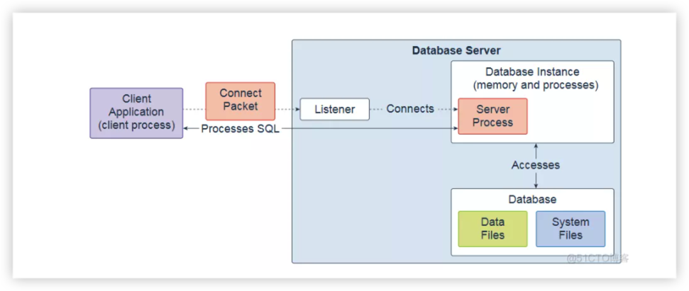

Oracle数据库至少包含一个数据库实例和一个数据库。数据库实例处理内存和进程。数据库由称为数据文件的物理文件组成，可以是非容器数据库或多租户容器数据库。Oracle数据库在其运行期间也使用多个数据库系统文件。

单实例数据库体系结构由一个数据库实例和一个数据库组成。数据库和数据库实例之间存在一对一的关系。可以在同一台服务器计算机上安装多个单实例数据库。每个数据库都有单独的数据库实例。此配置对于在同一台计算机上运行不同版本的Oracle数据库非常有用。

Oracle Real Application Clusters（Oracle RAC）数据库体系结构由在不同服务器计算机上运行的多个实例组成。它们都共享同一个数据库。服务器计算机集群在一端显示为单个服务器，在另一端显示为最终用户和应用程序。此配置旨在实现高可用性，可伸缩性和高端性能。

监听器是数据库服务器进程。它接收客户端请求，建立与数据库实例的连接，然后将客户端连接移交给服务器进程。侦听器可以在数据库服务器上本地运行或远程运行。典型的Oracle RAC环境是远程运行的。

## 2.数据库实例

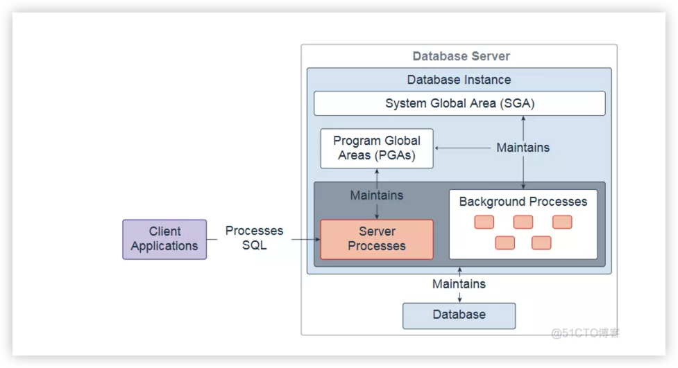

数据库实例包含一组Oracle数据库后台进程和内存结构。主存储器结构是系统全局区域（SGA）和程序全局区域（PGA）。后台进程对数据库中存储的数据（数据文件）进行操作，并使用内存结构进行工作。数据库实例仅存在于内存中。

Oracle数据库还创建服务器进程以代表客户端程序处理与数据库的连接，并为客户端程序执行工作; 例如，解析和运行SQL语句，以及检索结果并将结果返回给客户端程序。这些类型的服务器进程也称为前台进程。

## 3.系统全局区 SGA

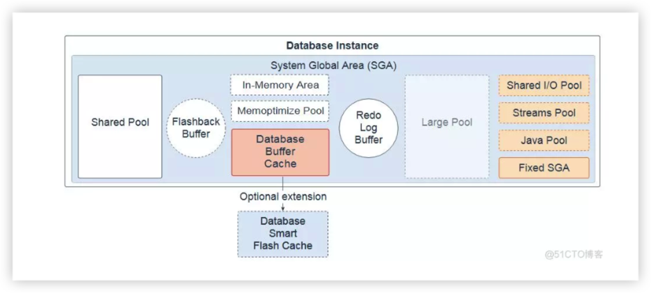

系统全局区域（SGA）是包含一个Oracle数据库实例的数据和控制信息的内存区域。所有服务器和后台进程共享SGA。启动数据库实例时，将显示为SGA分配的内存量。SGA包括以下数据结构：

+ 共享池：缓存可在用户之间共享的各种构造; 例如，共享池存储已解析的SQL，PL SQL代码，系统参数和数据字典信息。共享池几乎涉及数据库中发生的每个操作。例如，如果用户执行SQL语句，则Oracle数据库将访问共享池。
+ 闪回缓冲区：是SGA中的可选组件。启用闪回数据库后，将启动名为Recovery Writer Process（RVWR）的后台进程。RVWR定期将已修改的块从缓冲区高速缓存复制到闪回缓冲区，并将闪回数据库数据从闪回缓冲区顺序写入闪回数据库日志，这些日志将循环重用。
+ 数据库缓冲区缓存：存储区域是否存储从数据文件中读取的数据块的副本。缓冲区是主存储器地址，缓冲区管理器临时缓存当前或最近使用的数据块。并发连接到数据库实例的所有用户共享对缓冲区缓存的访问权限。
+ 数据库智能闪存缓存：是在Solaris或Oracle Linux上运行的数据库的数据库缓冲区缓存的可选内存扩展。它为数据库块提供2级缓存。它可以改善数据仓库（DW）环境中读取密集型联机事务处理（OLTP）工作负载和即席查询以及批量数据修改的响应时间和总体吞吐量。Database Smart Flash Cache驻留在一个或多个闪存磁盘设备上，这些设备是使用闪存的固态存储设备。数据库智能闪存缓存通常比额外的主存储器更经济，并且比磁盘驱动器快一个数量级。
+ 重做日志缓冲区： SGA中的循环缓冲区，用于保存有关对数据库所做更改的信息。此信息存储在重做条目中。重做条目包含通过数据操作语言（DML），数据定义语言（DDL）或内部操作重建（或重做）对数据库所做的更改所需的信息。如有必要，重做条目用于数据库恢复。
+ 大型池：是一个可选的内存区域，用于大于适用于共享池的内存分配。大型池可以为共享服务器和Oracle XA接口的用户全局区域（UGA）提供大内存分配（在事务与多个数据库交互时使用），并行执行语句时使用的消息缓冲区，Recovery Manager的缓冲区（ RMAN）I O从属和延迟插入。
+ 内存区域：是一个可选组件，它使对象（表，分区和其他类型）能够以称为柱状格式的新格式存储在内存中。此格式使扫描，连接和聚合的执行速度比传统的磁盘格式快得多，从而为OLTP和DW环境提供快速报告和DML性能。此功能对于在返回多行而不是OLTP的几列上运行的分析应用程序特别有用，OLTP在返回多列的几行上运行。
+ Memoptimize Pool：是一个可选组件，可为基于键的查询提供高性能和可伸缩性。Memoptimize Pool包含两个部分，memoptimize缓冲区和哈希索引。快速查找使用memoptimize池中的哈希索引结构，可以快速访问缓冲区缓存中永久固定的给定表（启用MEMOPTIMIZE FOR READ）的块，以避免磁盘I O. memoptimize池中的缓冲区与数据库缓冲区缓存完全分开。哈希索引是在配置Memoptimized Rowstore时创建的，并由Oracle数据库自动维护。
+ 共享IO池（SecureFiles）：用于SecureFile大对象（LOB）上的大型I O操作。LOB是一组旨在容纳大量数据的数据类型。SecureFile是一个LOB存储参数，允许重复数据删除，加密和压缩。
+ 流池：由Oracle Streams，Data Pump和GoldenGate集成捕获和应用流程使用。Streams池存储缓冲的队列消息，它为Oracle Streams捕获进程和应用进程提供内存。除非您专门配置它，否则Streams池的大小从零开始。使用Oracle Streams时，池大小会根据需要动态增长。
+ Java池：用于Java虚拟机（JVM）中所有特定于会话的Java代码和数据。Java池内存以不同的方式使用，具体取决于运行Oracle数据库的模式。
+ 修复了SGA：内部管理区域，包含有关数据库和数据库实例状态的一般信息，以及进程间通信的信息。

## 4.程序全局区 PGA

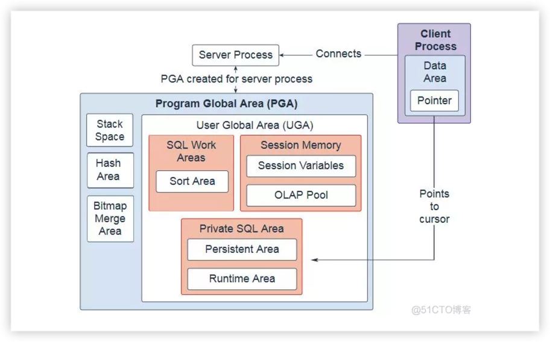

程序全局区域（PGA）是一个非共享内存区域，包含专门供服务器和后台进程使用的数据和控制信息。Oracle数据库创建服务器进程以代表客户端程序处理与数据库的连接。在专用服务器环境中，为每个启动的服务器和后台进程创建一个PGA。每个PGA由堆栈空间，散列区域，位图合并区域和用户全局区域（UGA）组成。当使用它的关联服务器或后台进程终止时，将释放PGA。

+ 在共享服务器环境中，多个客户端用户共享服务器进程。UGA被移动到大型池中，使PGA只有堆栈空间，散列区域和位图合并区域。
+ 在专用服务器会话中，PGA由以下组件组成：
  + SQL工作区：排序区域由订购数据的函数使用，例如ORDER BY和GROUP BY。
  + 会话存储器：该用户会话数据存储区域被分配用于会话变量，例如登录信息，以及数据库会话所需的其他信息。OLAP池管理OLAP数据页，它们等同于数据块。
  + 私有SQL区域：此区域包含有关已解析的SQL语句和其他特定于会话的信息以供处理的信息。当服务器进程执行SQL或PL SQL代码时，该进程使用私有SQL区域来存储绑定变量值，查询执行状态信息和查询执行工作区。相同或不同会话中的多个私有SQL区域可以指向SGA中的单个执行计划。持久区域包含绑定变量值。运行时区域包含查询执行状态信息。游标是私有SQL区域中特定区域的名称或句柄。您可以将游标视为客户端上的指针和服务器端的状态。由于游标与私有SQL区域紧密相关，因此这些术语有时可互换使用。
  + 堆栈空间：堆栈空间是分配用于保存会话变量和数组的内存。
  + 散列区：此区域用于执行表的散列连接。
  + 位图合并区域：此区域用于合并从多个位图索引的扫描中检索的数据。

## 5.后台进程 Background Processes

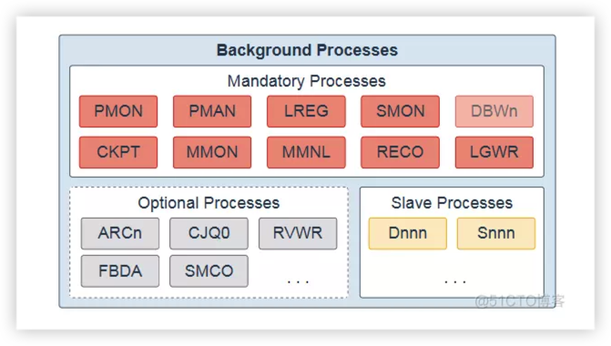

后台进程是数据库实例的一部分，执行操作数据库所需的维护任务，并最大限度地提高多个用户的性能。每个后台进程都执行一项独特的任务，但与其他进程一起使用。启动数据库实例时，Oracle数据库会自动创建后台进程。存在的后台进程取决于数据库中使用的功能。启动数据库实例时，将自动启动强制后台进程。您可以根据需要稍后启动可选后台进程。

所有典型的数据库配置中都存在强制后台进程。默认情况下，这些进程在读/写数据库实例中运行，并使用最低配置的初始化参数文件启动。只读数据库实例会禁用其中一些进程。强制性后台进程包括进程监视进程（PMON），进程管理进程（PMAN），监听器注册进程（LREG），系统监视进程（SMON），数据库写入进程（DBWn），检查点进程（CKPT），可管理性监视进程（ MMON），Manageability Monitor Lite Process（MMNL），Recoverer Process（RECO）和Log Writer Process（LGWR）。

大多数可选后台进程特定于任务或功能。一些常见的可选流程包括Archiver Processes（ARCn），作业队列协调器流程（CJQ0），Recovery Writer Process（RVWR），闪回数据存档流程（FBDA）和空间管理协调器流程（SMCO）。

从属进程是代表其他进程执行工作的后台进程; 例如，Dispatcher Process（Dnnn）和Shared Server Process（Snnn）。

## 6.共享池 Shared Pool
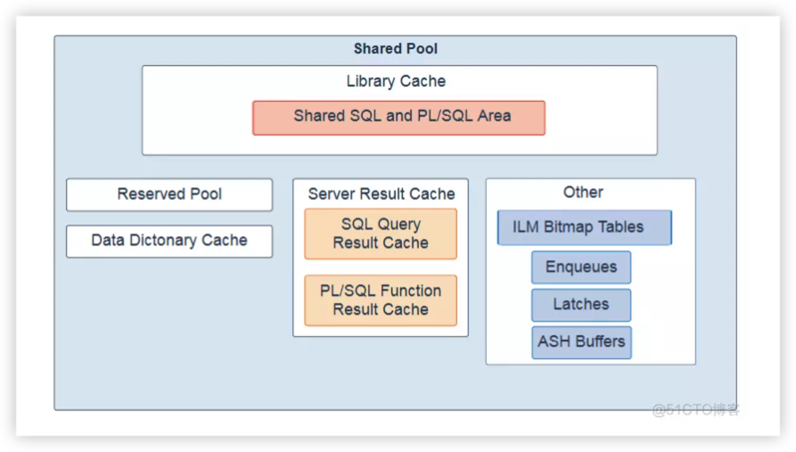

共享池是系统全局区域（SGA）的一个组件，负责缓存各种类型的程序数据。例如，共享池存储已解析的SQL，PL SQL代码，系统参数和数据字典信息。共享池几乎涉及数据库中发生的每个操作。例如，如果用户执行SQL语句，则Oracle数据库将访问共享池。

共享池分为几个子组件：

+ 库高速缓存：是一种存储可执行SQL和PL SQL代码的共享池内存结构。此缓存包含共享的SQL和PL SQL区域和控制结构，例如锁和库缓存句柄。执行SQL语句时，数据库会尝试重用以前执行的代码。如果库缓存中存在已解析的SQL语句表示并且可以共享，则数据库将重用该代码。此操作称为软解析或库缓存命中。否则，数据库必须构建应用程序代码的新可执行版本，这称为硬解析或库高速缓存未命中。
+ 预留池： Oracle数据库可用于分配大量连续内存块的共享池中的内存区域。数据库以块的形式从共享池中分配内存。Chunking允许将大对象（超过5 KB）加载到缓存中，而不需要单个连续区域。通过这种方式，数据库可以减少由于碎片而耗尽连续内存的可能性。
+ 数据字典缓存：存储有关数据库对象（即字典数据）的信息。此缓存也称为行缓存，因为它将数据保存为行而不是缓冲区。
+ 服务器结果缓存：共享池中的内存池并保存结果集。服务器结果缓存包含SQL查询结果缓存和PL SQL函数结果缓存，它们共享相同的基础结构。SQL查询结果缓存存储查询和查询片段的结果。大多数应用程序都受益于此性能改进 PL SQL函数结果缓存存储函数结果集。结果缓存的良好候选者经常被调用依赖于相对静态数据的函数。
+ 其他组件：包括队列，锁存器，信息生命周期管理（ILM）位图表，活动会话历史记录（ASH）缓冲区和其他次要内存结构。队列是共享内存结构（锁），用于序列化对数据库资源的访问。它们可以与会话或事务相关联。示例包括：Controlfile Transaction，Datafile，Instance Recovery，Media Recovery，Transaction Recovery，Job Queue等。锁存器用作低级串行化控制机制，用于保护SGA中的共享数据结构不被同时访问。例如行缓存对象，库缓存引脚和日志文件并行写入。

## 7.大对象池 Large Pool

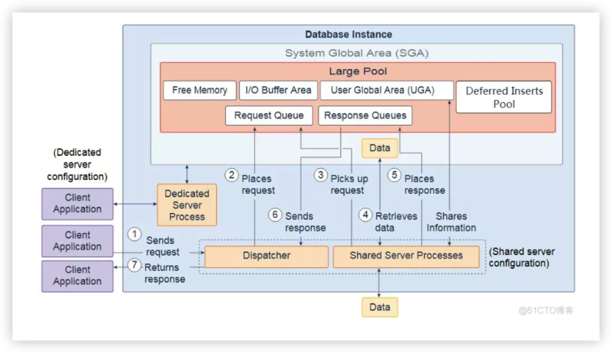

大型池是一个可选的内存区域，数据库管理员可以配置该区域为以下内容提供大量内存分配：

+ 用户全局区域（UGA）：共享服务器和Oracle XA接口的会话内存（用于事务与多个数据库交互的位置）
+ IO缓冲区： IO服务器进程，并行查询操作中使用的消息缓冲区，Recovery Manager（RMAN）IO从站的缓冲区和高级排队内存表存储
+ 延迟插入池：快速摄取功能可以将高频单行数据插入到数据库中，用于定义为MEMOPTIMIZE FOR WRITE的表。快速摄取的插入物也称为延迟插入物。它们最初在大型池中进行缓冲，然后由空间管理协调器（SMCO）和Wxxx从属后台进程异步写入磁盘，每个对象每个会话写入1MB后或60秒后写入。在SMCO后台进程扫描之前，任何会话（包括编写器）都无法读取此池中缓冲的任何数据，甚至是已提交的数据。
池在memoptimized表的第一个插入行的大池中初始化。当有足够的空间时，从大型池中分配2G。如果大型池中没有足够的空间，则会在内部发现ORA-4031并自动清除。重新分配请求大小的一半。如果大型池中仍有足够的空间，则使用512M和256M重试分配，之后将禁用该功能，直到重新启动实例。池初始化后，大小保持不变。它不能增长或缩小。
+ 免费记忆
大型池与共享池中的保留空间不同，后者使用与共享池分配的其他内存相同的最近最少使用（LRU）列表。大型池没有LRU列表。分配内存块，并且在完成使用之前不能释放它们。

来自用户的请求是单个API调用，它是用户SQL语句的一部分。在专用服务器环境中，一个服务器进程处理单个客户端进程的请求。每个服务器进程都使用系统资源，包括CPU周期和内存。在共享服务器环境中，会发生以下操作：

1. 客户端应用程序向数据库实例发送请求，调度程序接收该请求。
2. 调度程序将请求放在大池中的请求队列中。
3. 该请求由下一个可用的共享服务器进程选取。共享服务器进程检查公共请求队列中的新请求，以先进先出的方式获取新请求。一个共享服务器进程在队列中获取一个请求。
4. 共享服务器进程对数据库进行所有必要的调用以完成请求。首先，共享服务器进程访问共享池中的库高速缓存以验证所请求的项; 例如，它检查表是否存在，用户是否具有正确的权限，等等。接下来，共享服务器进程访问缓冲区高速缓存以检索数据。如果数据不存在，则共享服务器进程访问磁盘。不同的共享服务器进程可以处理每个数据库调用。因此，解析查询，获取第一行，获取下一行和关闭结果集的请求可以由不同的共享服务器进程处理。由于不同的共享服务器进程可以处理每个数据库调用，因此用户全局区域（UGA）必须是共享内存区域，因为UGA包含有关每个客户端会话的信息。或者相反，UGA包含有关每个客户端会话的信息，并且必须可用于所有共享服务器进程，因为任何共享服务器进程都可以处理任何会话的数据库调用。
5. 请求完成后，共享服务器进程将响应放在大池中的调用调度程序的响应队列中。每个调度程序都有自己的响应队列。
6. 响应队列将响应发送给调度程序。
7. 调度程序将完成的请求返回给相应的客户端应用程序。

## 8.数据库缓冲区缓存 Database Buffer Cache

数据库缓冲区高速缓存（也称为缓冲区高速缓存）是系统全局区（SGA）中的存储区，用于存储从数据文件读取的数据块的副本。缓冲区是数据库块大小的内存块。每个缓冲区都有一个称为数据库缓冲区地址（DBA）的地址。并发连接到数据库实例的所有用户共享对缓冲区缓存的访问权限。缓冲区高速缓存的目标是优化物理I O并将频繁访问的块保留在缓冲区高速缓存中，并将不经常访问的块写入磁盘。

Oracle数据库用户进程第一次需要特定的数据时，它会搜索数据库缓冲区高速缓存中的数据。如果进程发现缓存中的数据（缓存命中），它可以直接从内存中读取数据。如果进程无法在缓存中找到数据（缓存未命中），则必须在访问数据之前将数据块从磁盘上的数据文件复制到缓存中的缓冲区中。通过缓存命中访问数据比通过缓存未命中访问数据更快。

缓存中的缓冲区由复杂算法管理，该算法使用最近最少使用（LRU）列表和触摸计数的组合。LRU有助于确保最近使用的块倾向于留在内存中以最小化磁盘访问。

数据库缓冲区缓存包含以下内容：

+ 默认池：通常是缓存块的位置。默认块大小为8 KB。除非您手动配置单独的池，否则默认池是唯一的缓冲池。其他池的可选配置对默认池没有影响。
+ 保留池：适用于经常访问但由于空间不足而在默认池中老化的块。保持缓冲池的目的是将指定的对象保留在内存中，从而避免I O操作。
回收池：适用于不经常使用的块。循环池可防止指定的对象占用缓存中不必要的空间。
+ 非默认缓冲池：适用于使用非标准块大小2 KB，4 KB，16 KB和32 KB的表空间。每个非默认块大小都有自己的池。Oracle数据库以与默认池中相同的方式管理这些池中的块。
+ 数据库智能闪存缓存（闪存缓存）：允许您使用闪存设备来增加缓冲区缓存的有效大小，而无需添加更多主内存。Flash缓存可以通过将数据库缓存的频繁访问数据存储到闪存而不是从磁盘读取数据来提高数据库性能。当数据库请求数据时，系统首先查找数据库缓冲区缓存。如果未找到数据，则系统会在Database Smart Flash Cache缓冲区中查找。如果它没有在那里找到数据，那么它只会在磁盘存储中查找。您必须在Oracle Real Application Clusters环境中的所有实例或没有实例上配置闪存缓存。
+ 最近最少使用列表（LRU）：包含指向脏缓冲区和非脏缓冲区的指针。LRU列表具有热端和冷端。冷缓冲区是最近未使用的缓冲区。经常访问热缓冲区并且最近已经使用过。从概念上讲，只有一个LRU，但对于数据并发，数据库实际上使用了几个LRU。
+ 检查点队列
+ 闪存缓冲区：由DEFAULT Flash LRU链和KEEP Flash LRU链组成。如果没有Database Smart Flash Cache，当进程尝试访问块并且缓冲区缓存中不存在该块时，该块将首先从磁盘读入内存（物理读取）。当内存缓冲区高速缓存变满时，缓冲区将根据最近最少使用（LRU）机制从内存中逐出。使用Database Smart Flash Cache，当一个干净的内存缓冲区老化时，缓冲区内容将由Database Writer进程（DBWn）在后台写入闪存缓存，并且缓冲区标头作为元数据保存在内存中DEFAULT flash或KEEP Flash LRU列表，具体取决于值FLASH_CACHE对象属性。KEEP闪存LRU列表用于将缓冲区标头维护在单独的列表中，以防止常规缓冲区标头替换它们。因此，属于指定为KEEP的对象的闪存缓冲区头部 倾向于更长时间地保留在闪存缓存中。如果FLASH_CACHE 对象属性设置为NONE，系统不会在闪存缓存或内存中保留相应的缓冲区。当再次访问已经过时内存的缓冲区时，系统会检查闪存缓存。如果找到缓冲区，它会从闪存缓存中读回缓存，这只需要从磁盘读取的一小部分时间。跨Real Application Clusters（RAC）的闪存缓存缓冲区的一致性与Cache Fusion的维护方式相同。由于闪存缓存是扩展缓存，并且直接路径I O完全绕过缓冲区缓存，因此该功能不支持直接路径IO.

## 9.内存区 In-Memory Area
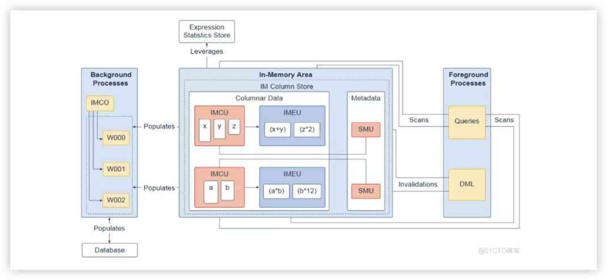

内存区域是一个可选的SGA组件，包含内存中列存储（IM列存储），它使用针对快速扫描优化的柱形格式在内存中存储表和分区。IM列存储使数据能够以传统的行格式（在缓冲区缓存中）和柱状格式同时填充在SGA中。数据库透明地将在线事务处理（OLTP）查询（例如主键查找）发送到缓冲区高速缓存，并将分析和报告查询发送到IM列存储。在获取数据时，Oracle数据库还可以从同一查询中的两个内存区域读取数据。双格式架构不会使内存要求增加一倍。

您应该只填充IM列存储中性能最关键的数据。要将对象添加到IM列存储，请在创建或更改对象时打开对象的INMEMORY属性。您可以在表空间（对于表空间中的所有新表和视图），表，（子）分区，物化视图或对象中的列子集中指定此属性。

IM列存储以优化的存储单元管理数据和元数据，而不是传统的Oracle数据块。内存中压缩单元（IMCU）是一个压缩的只读存储单元，包含一列或多列的数据。快照元数据单元（SMU）包含关联的IMCU的元数据和事务信息。每个IMCU都映射到一个单独的SMU。

表达式统计信息存储（ESS）是存储有关表达式评估的统计信息的存储库。ESS驻留在SGA中并且还存在于磁盘上。启用IM列存储后，数据库会利用ESS实现其内存中表达式（IM表达式）功能。内存中表达单元（IMEU）是物化IM表达式和用户定义虚拟列的存储容器。请注意，ESS独立于IM列存储。ESS是数据库的永久组件，无法禁用。

从概念上讲，IMEU是其父IMCU的逻辑扩展。就像IMCU可以包含多个列一样，IMEU可以包含多个虚拟列。每个IMEU映射到一个IMCU，映射到同一行集。IMEU包含其相关IMCU中包含的数据的表达式结果。填充IMCU时，也会填充关联的IMEU。

典型的IM表达式涉及一个或多个列，可能具有常量，并且与表中的行具有一对一映射。例如，EMPLOYEES表的IMCU 包含rows_allary列的行1-1000 。对于存储在此IMCU中的行，IMEU计算自动检测到的IM表达式weekly_salary * 52，以及用户定义的虚拟列quarterly_salary， 定义为weekly_salary * 12。IMCU中的第三行向下映射到IMEU中的第三行。

内存区域被细分为两个池：1MB柱状数据池，用于存储填充到内存中的实际列格式数据（IMCU和IMEU），以及64K元数据池，用于存储有关对象的元数据填充到IM列存储中。两个池的相对大小由内部启发式确定; 大多数内存区域内存分配给1MB池。内存区域的大小由初始化参数INMEMORY_SIZE（默认为0）控制，最小大小必须为100MB。从Oracle Database 12.2开始，您可以通过增加INMEMORY_SIZE参数来动态增加In-Memory区域的大小。ALTER SYSTEM命令至少128MB。请注意，无法动态缩小内存区域的大小。

内存表在第一个表数据访问或数据库启动时获取在IM列存储中分配的IMCU。通过从磁盘格式到新的内存中列式格式的转换来创建表的内存中副本。每次实例重新启动时都会执行此转换，因为IM列存储副本仅驻留在内存中。完成此转换后，表的内存中版本将逐渐可用于查询。如果某个表被部分转换，查询可以使用部分内存中版本并转到磁盘以进行其余操作，而不是等待转换整个表。

响应于查询和数据操纵语言（DML），服务器进程扫描列式数据并更新SMU元数据。后台进程将行数据从磁盘填充到IM列存储中。内存中协调器进程（IMCO）是一个后台进程，可启动背景填充和重新填充列数据。空间管理协调员进程（SMCO）和空间管理工作进程（Wnnn）是代表IMCO实际填充和重新填充数据的后台进程。DML块更改将写入缓冲区缓存，然后写入磁盘。然后，后台进程根据元数据失效和查询请求将行数据从磁盘重新填充到IM列存储中。

您可以启用内存中快速启动功能，将IM列存储中的列数据以压缩列格式写回数据库中的表空间。此功能使数据库启动更快。请注意，此功能不适用于IMEU。它们始终从IMCU动态填充。

## 10.数据库数据文件

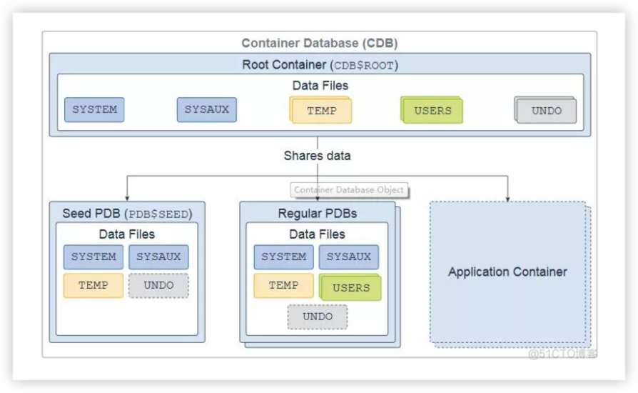

数据库是一组存储用户数据和元数据的物理文件。元数据包含有关数据库服务器的结构，配置和控制信息。您可以将数据库设计为多租户容器数据库（CDB）或非容器数据库（非CDB）。

CDB由一个CDB根容器（也称为根），一个种子可插拔数据库（种子PDB），零个或多个用户创建的可插拔数据库（简称为PDB）以及零个或多个应用程序容器组成。整个CDB称为系统容器。对于用户或应用程序，PDB在逻辑上显示为单独的数据库。

名为CDB $ ROOT的CDB根包含多个数据文件，控制文件，重做日志文件，闪回日志和归档重做日志文件。数据文件存储Oracle提供的元数据和公共用户（每个容器中已知的用户），这些用户与所有PDB共享。

种子PDB，名为PDB $ SEED，是系统提供的PDB模板，包含可用于创建新PDB的多个数据文件。

常规PDB包含多个数据文件，其中包含支持应用程序所需的数据和代码; 例如，人力资源应用程序。用户仅与PDB交互，而不与种子PDB或根容器交互。您可以在CDB中创建多个PDB。多租户架构的目标之一是每个PDB与应用程序具有一对一的关系。

应用程序容器是CDB中可选的PDB集合，用于存储应用程序的数据。创建应用程序容器的目的是具有单个主应用程序定义。您可以在CDB中拥有多个应用程序容器。

数据库分为称为表空间的逻辑存储单元，它们共同存储所有数据库数据。每个表空间代表一个或多个数据文件。根容器和常规PDB具有SYSTEM，SYSAUX， USERS，TEMP和UNDO表空间（在常规PDB中是可选的）。种子PDB具有SYSTEM， SYSAUX，TEMP和可选的UNDO表空间。

## 11.数据库系统文件

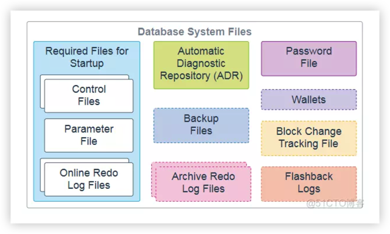

以下数据库系统文件在Oracle数据库操作期间使用，驻留在数据库服务器上。请注意，数据文件是属于数据库容器的物理文件，此处不再赘述。

+ 控制文件：控制文件是存储有关数据文件和联机重做日志文件的元数据的必需文件; 例如，他们的名字和状态。数据库实例需要此信息才能打开数据库。控制文件还包含在数据库未打开时必须可访问的元数据。强烈建议您在数据库服务器中制作控制文件的多个副本以获得高可用性。
+ 参数文件：此必需文件定义数据库实例启动时的配置方式。它可以是初始化参数文件（pfile）或服务器参数文件（spfile）。
+ 联机重做日志文件：这些必需文件在数据库发生时存储对数据库的更改，并用于数据恢复。
+ 自动诊断存储库（ADR）： ADR是基于文件的数据库诊断数据存储库，例如跟踪，转储，警报日志，运行状况监视器报告等。它具有跨多个实例和多个产品的统一目录结构。数据库，Oracle自动存储管理（Oracle ASM），侦听器，Oracle Clusterware和其他Oracle产品或组件将所有诊断数据存储在ADR中。每个产品的每个实例都将诊断数据存储在ADR中其自己的主目录下。
+ 备份文件：这些可选文件用于数据库恢复。您通常在介质故障或用户错误已损坏或删除原始文件时还原备份文件。
存档的重做日志文件：这些可选文件包含数据库实例生成的数据更改的持续历史记录。使用这些文件和数据库备份，您可以恢复丢失的数据文件。也就是说，存档日志可以恢复已恢复的数据文件。
+ 密码文件：此可选文件使使用SYSDBA，SYSOPER， SYSBACKUP，SYSDG， SYSKM，SYSRAC和SYSASM角色的用户能够远程连接到数据库实例并执行管理任务。
+ 钱包：对于应用程序使用密码凭据连接到数据库的大规模部署，可以将此类凭据存储在客户端Oracle钱包中。Oracle钱包是一个安全的软件容器，用于存储身份验证和签名凭据。可能的钱包包括用于用户凭证的Oracle钱包，用于透明数据加密（TDE）的加密钱包，以及用于数据库备份云模块的Oracle公共云（OPC）钱包。钱包是可选的，但建议使用。
+ 块更改跟踪文件：块更改跟踪通过在块更改跟踪文件中记录更改的块来提高增量备份的性能。在增量备份期间，Oracle Recovery Manager（RMAN）使用此文件来识别需要备份的已更改块，而不是扫描所有数据块以识别哪些块已更改。块更改跟踪文件是可选的。
+ 闪回日志：闪回数据库的效果类似于传统的时间点恢复。它使您能够在最近的某个时间将数据库返回到其状态。闪回数据库使用自己的日志记录机制，创建闪回日志并将其存储在快速恢复区域中。仅当闪回日志可用时，才能使用闪回数据库。要利用此功能，必须事先设置数据库以创建闪回日志。闪回日志是可选的。
可以多路复用控制文件，联机重做日志文件和存档重做日志文件，这意味着可以在不同位置自动维护两个或更多相同的副本。

## 12.应用容器
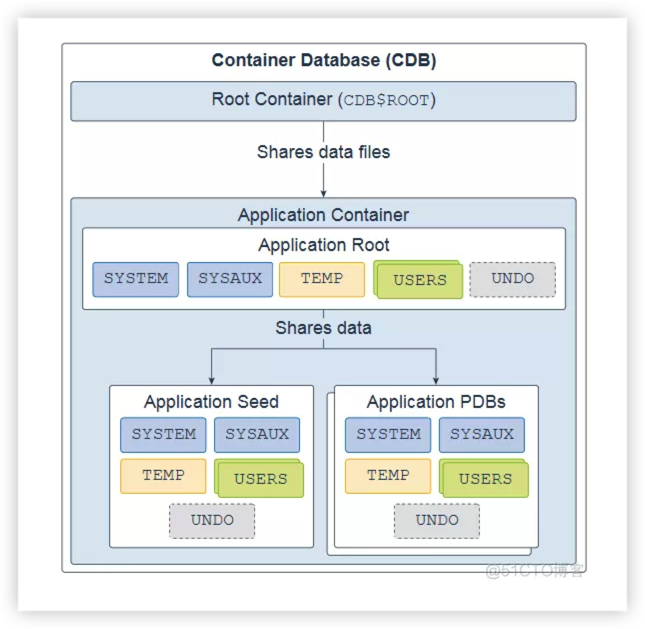

容器是用户创建的可选CDB组件，用于存储应用PDB的数据和元数据。CDB可以包括零个或多个容器。容器只包含一个容器根目录和一个或多个应用程序PDB，它们插入CDB根目录。应用程序根目录属于CDB根目录，不属于其他容器，并存储公共元数据和数据。

典型的应用程序安装应用程序公共用户，元数据链接的公共对象和数据链接的公共对象。您可以在一个应用程序容器中创建多个与销售相关的PDB，这些PDB共享一个应用程序后端，该后端由一组公共表和表定义组成。

应用程序根，应用程序种子和应用程序PDB均具有 SYSTEM，SYSAUX， TEMP，USERS和可选的UNDO表空间。每个表空间代表一个或多个数据文件。

## 13.自动诊断存储库

自动诊断存储库（ADR）是用于数据库诊断数据的系统范围的跟踪和日志记录中央存储库。它包括以下项目：

+ 后台跟踪文件：每个数据库后台进程都可以写入关联的跟踪文件。当进程检测到内部错误时，进程会将有关错误的信息转储到其跟踪文件中。写入跟踪文件的某些信息适用于数据库管理员，而其他信息适用于Oracle支持服务。通常，数据库后台进程跟踪文件名包含Oracle系统标识符（SID），后台进程名称和操作系统进程号。RECO进程的跟踪文件示例是mytest_reco_10355.trc。
+ 前台跟踪文件：每个服务器进程都可以写入关联的跟踪文件。当进程检测到内部错误时，进程会将有关错误的信息转储到其跟踪文件中。服务器进程跟踪文件名包含Oracle SID，字符串ora和操作系统进程号。服务器进程跟踪文件名的示例是mytest_ora_10304.trc。
+ 转储文件：诊断转储文件是一种特殊类型的跟踪文件，其中包含有关状态或结构的详细时间点信息。转储文件通常是响应于事件的一次性诊断数据输出，而跟踪文件往往是诊断数据的连续输出。
+ 运行状况监视器报告： Oracle数据库包含一个名为Health Monitor的框架，用于对数据库运行诊断检查。运行状况检查可检测文件损坏，物理和逻辑块损坏，撤消和重做损坏，数据字典损坏等。健康检查会生成他们的调查结果报告，并在许多情况下生成解决问题的建议。
+ 事件包：对于将诊断数据上载到Oracle Support的自定义方法，首先将数据收集到称为事件包（包）的中间逻辑结构中。包是元数据的集合，存储在ADR中并指向ADR内部和外部的诊断数据文件和其他文件。创建包时，选择要添加到包中的一个或多个问题。然后，Support Workbench会自动将与所选问题相关的问题信息，事件信息和诊断数据（如跟踪文件和转储）添加到软件包中。
+ 事件转储：发生事件时，数据库会将一个或多个转储写入为事件创建的事件目录。事件转储还包含文件名中的事件编号。
+ 警报日志文件：数据库的警报日志是消息和错误的时间顺序日志。Oracle建议您定期查看警报日志。

## 14.备份文件

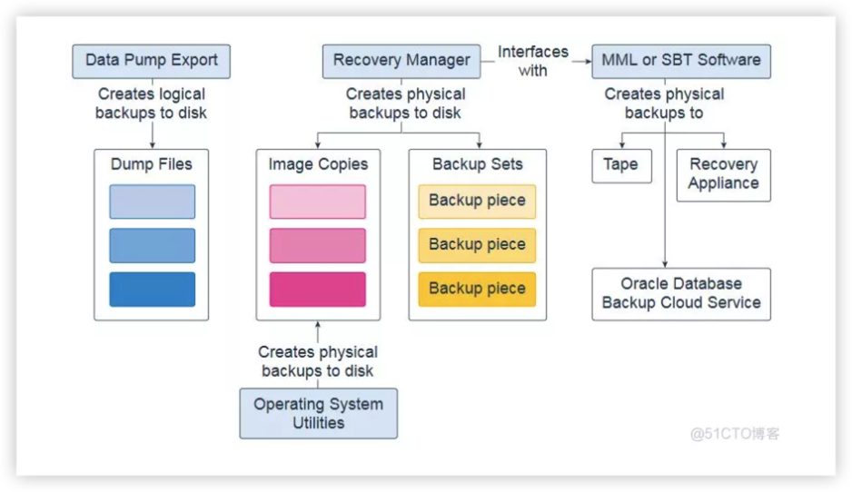

数据库备份可以是物理备份或逻辑备份。

+ 物理备份是物理数据库文件的副本。您可以使用Recovery Manager（RMAN）或操作系统实用程序进行物理备份。
+ 逻辑备份包含表，存储过程和其他逻辑数据。您可以使用Oracle数据库实用程序（例如Data Pump Export）提取逻辑数据，并将其存储在二进制文件中。逻辑备份可以补充物理备份。

RMAN创建的数据库备份存储为映像副本或备份集。
+ 一个映像副本是一个数据文件，控制文件或归档重做日志文件的位对位，磁盘上的重复。您可以使用操作系统实用程序或RMAN创建物理文件的映像副本，并使用任一工具还原它们。映像副本对磁盘很有用，因为您可以逐步更新它们并在适当的位置恢复它们。
+ 一个备份集是由包含一个或多个数据文件中的数据RMAN，归档重做日志文件，控制文件或服务器参数文件中创建一个专有格式。备份集的最小单元是称为备份片的二进制文件。备份集是RMAN可以将备份写入顺序设备（如磁带驱动器）的唯一形式。备份集的一个优点是RMAN使用未使用的块压缩来节省备份数据文件的空间。只有数据文件中用于存储数据的那些块才包含在备份集中。备份集也可以压缩，加密，发送到磁带，并使用数据文件副本不可用的高级未使用空间压缩。

RMAN可以与媒体管理库（MML）或系统备份到磁带（SBT）软件连接，该软件可以创建磁带，Oracle数据库备份云服务或零数据丢失恢复设备（通常称为恢复设备）的备份。

## 15. 进程监控进程

进程监视进程（PMON）是一个后台进程，它定期扫描所有进程以查找异常死亡的进程。然后，PMON负责协调清理主进程（CLMN）和清除从进程从属（CLnn）执行的清理。

PMON作为操作系统进程运行，而不是作为线程运行。除数据库实例外，PMON还可在Oracle自动存储管理（ASM）实例和Oracle ASM代理实例上运行

## 16. 进程管理器进程
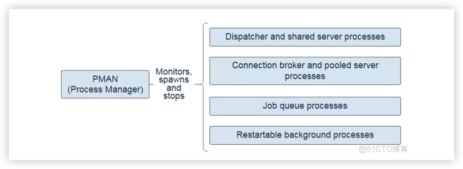
进程管理器进程（PMAN）是一个后台进程，可根据需要监视，生成和停止以下操作：

+ 调度程序和共享服务器进程
+ 数据库驻留连接池的连接代理和池化服务器进程
+ 作业队列进程
+ 可重启的后台进程

PMAN作为操作系统进程运行，而不是作为线程运行。除数据库实例外，PMAN还可在Oracle自动存储管理（ASM）实例和Oracle ASM代理实例上运行。

## 17.监听器注册进程
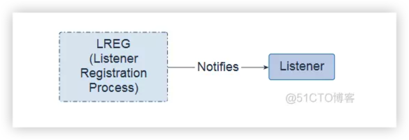

监听器注册过程（LREG）是一个后台进程，它向监听器通知实例，服务，处理程序和端点。

LREG可以作为线程或操作系统进程运行。除数据库实例外，LREG还可以在Oracle自动存储管理（ASM）实例和Oracle Real Application Clusters（RAC）上运行。

## 18.系统监视器进程
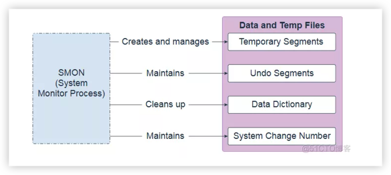

系统监视器进程（SMON）是执行许多数据库维护任务的后台进程，包括以下内容：

+ 创建和管理临时表空间元数据，并回收孤立临时段使用的空间
+ 通过基于撤消空间使用统计信息对还原段进行内联，脱机和缩小来维护撤消表空间
+ 当数据字典处于瞬态和不一致状态时清理它
+ 维护系统更改编号（SCN）到用于支持Oracle闪回功能的时间映射表
  
SMON可以抵御后台活动中产生的内部和外部错误。SMON可以作为线程或操作系统进程运行。在Oracle Real Application Clusters（RAC）数据库中，一个实例的SMON进程可以为其他失败的实例执行实例恢复。

## 19.写库进程
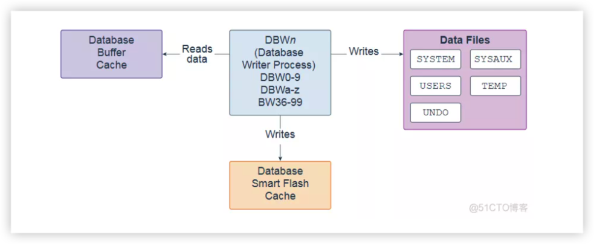
写库进程（DBWn）是一个后台进程，主要将数据块写入磁盘。它还处理检查点，文件打开同步和Block Written记录的日志记录。配置Flash Cache时，DBWn还会写入数据库智能闪存缓存（Flash Cache）。

在许多情况下，DBWn写入的块分散在整个磁盘中。因此，写入倾向于比由Log Writer Process（LGWR）执行的顺序写入慢。DBWn在可能的情况下执行多块写入以提高效率。在多块写入中写入的块数因操作系统而异。

该DB_WRITER_PROCESSES初始化参数指定数据库写进程的数量。可以有1到100个数据库写程序进程。前36个数据库写程序进程的名称是DBW0-DBW9和DBWa-DBWz。第37到第100个数据库写程序进程的名称是BW36-BW99。数据库为DB_WRITER_PROCESSES 参数选择适当的默认设置，或根据CPU和处理器组的数量调整用户指定的设置。

## 20.检查点进程
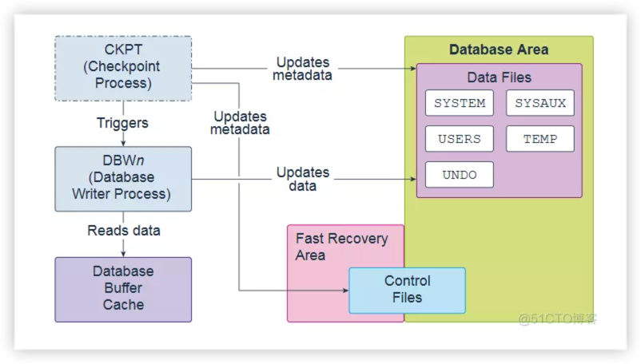

检查点进程（CKPT）是一个后台进程，在特定时间通过消息传递Database Writer Process（DBWn）启动检查点请求以开始写入脏缓冲区。完成单个检查点请求后，CKPT会更新数据文件头和控制文件以记录最近的检查点。

CKPT每三秒检查一次，以查看内存量是否超过PGA_AGGREGATE_LIMIT 初始化参数的值，如果是，则执行操作。

CKPT可以作为线程或操作系统进程运行。除数据库实例外，CKPT还可在Oracle自动存储管理（ASM）实例上运行。

## 21.可管理性监视进程(MMON)和可管理性监视器精简进程
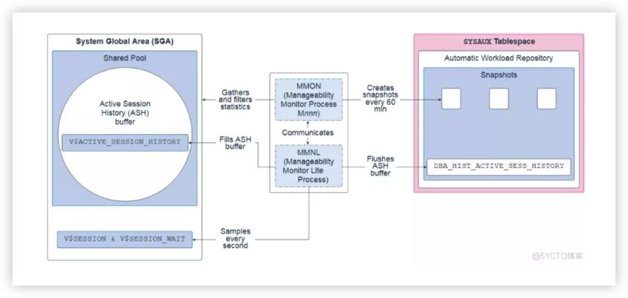

可管理性监视进程（MMON）和可管理性监视器精简进程（MMNL）是执行与自动工作负载存储库（AWR）相关的任务的后台进程。AWR是历史性能数据的存储库，包括系统，会话，单个SQL语句，段和服务的累积统计信息。它用于问题检测和自我调整目的。

MMON从SGA收集各种内存统计信息，过滤它们，然后在自动工作负载存储库（AWR）中每60分钟创建一次这些统计信息的快照。60分钟是默认值，可以更改。它还执行自动数据库诊断监视（ADDM）分析，并为超过其阈值的指标发出警报。

MMNL收集会话统计信息（例如用户ID，状态，计算机和正在执行的SQL）并将它们存储在活动会话历史记录（ASH）缓冲区中。具体来说，MMNL 每秒在SGA 中对V $ SESSION 和V $ SESSION_WAIT视图进行采样，然后将该数据记录在V $ ACTIVE_SESSION_HISTORY 视图中。不对非活动会话进行采样。ASH被设计为内存中的滚动缓冲区，因此，在需要时会覆盖早期信息。当ASH缓冲区变满或MMON拍摄快照时，MMNL将ASH缓冲区刷新（清空）到DBA_HIST_ACTIVE_SESS_HISTORY查看AWR。由于空间昂贵，每10个条目中只有一个被刷新。MMNL还计算指标。

MMON和MMNL都可以作为线程或操作系统进程运行。除数据库实例外，MMON和MMNL还可以在自动存储管理（ASM）实例上运行。

## 22.Recoverer 进程

Recoverer Process（RECO）是一个后台进程，它解决因分布式数据库中的网络或系统故障而待处理的分布式事务。

RECO可以作为线程或操作系统进程运行。

## 23.写日志进程
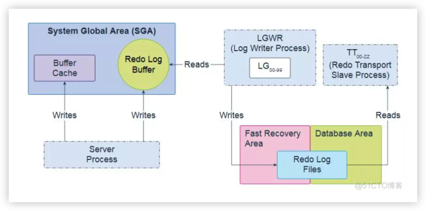
Log Writer Process（LGWR）是一个后台进程，它将重做日志条目按顺序写入重做日志文件。重做日志条目在系统全局区域（SGA）的重做日志缓冲区中生成。如果数据库具有多路复用重做日志，则LGWR会将相同的重做日志条目写入重做日志文件组的所有成员。

LGWR处理非常快或必须协调的操作，并将操作委托给可以从并发操作中受益的Log Writer Worker辅助进程（LGnn），主要是将重做从日志缓冲区写入重做日志文件并发布完成写入正在等待的前台进程。

重做传输从属进程（TT00-zz）将重做从当前的联机和备用重做日志发送到为异步（ASYNC）重做传输配置的远程备用目标。

LGWR可以作为线程或操作系统进程运行。除数据库实例外，LGWR还可以在Oracle ASM实例上运行。Oracle Real Application Clusters（RAC）配置中的每个数据库实例都有自己的一组重做日志文件。

## 24.归档进程
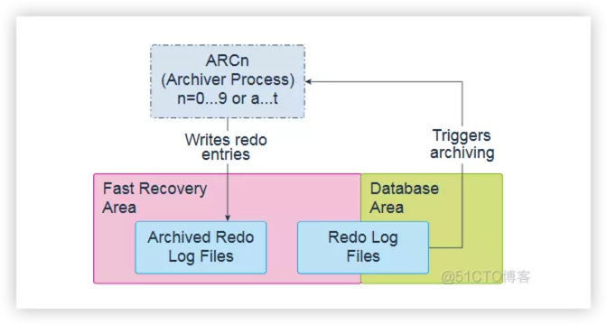

Archiver Processes（ARCn）是仅在数据库处于ARCHIVELOG模式且启用了自动存档时才存在的后台进程，在这种情况下，ARCn会自动存档联机重做日志文件。Log Writer Process（LGWR）在归档之前无法重用和覆盖联机重做日志组。

数据库根据需要启动多个归档进程，以确保填充的联机重做日志的归档不会落后。可能的过程包括ARC0-ARC9和ARCa-ARCt（31个可能的目的地）。

所述LOG_ARCHIVE_MAX_PROCESSES 初始化参数指定的ARCn的进程数数据库最初调用。如果预计归档的工作量很大，例如在批量加载数据期间，则可以增加归档进程的最大数量。还可以有多个归档日志目标。建议每个目标至少有一个归档进程。

## 25.作业队列协调器进程

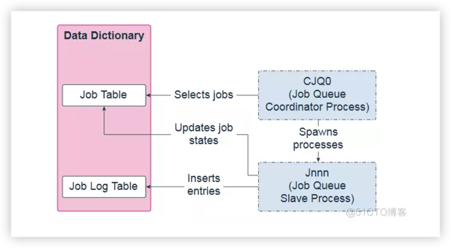

作业队列协调器进程（CJQ0）是一个后台进程，它选择需要从数据字典运行的作业，并生成作业队列从属进程（Jnnn）以运行作业。Oracle Scheduler根据需要自动启动和停止CJQ0。该JOB_QUEUE_PROCESSES 初始化参数指定的可为作业的执行创建的最大进程数。CJQ0仅启动与要运行的作业数和可用资源所需的作业队列进程数相同的数量。

作业队列从属进程（Jnnn）执行作业协调器分配的作业。选择作业进行处理时，作业从站执行以下操作：

+ 收集运行作业所需的所有元数据，例如，程序参数和权限信息。
+ 以作业所有者的身份启动数据库会话，启动事务，然后开始执行作业。
+ 作业完成后，从站提交并结束交易。
+ 关闭会话。

作业完成后，从站执行以下操作：
+ 如果需要，重新安排工作
+ 更新作业表中的状态以反映作业是已完成还是计划再次运行
+ 将条目插入作业日志表
+ 更新运行计数，如有必要，更新失败并重试计数
+ 清理
+ 寻找新工作（如果没有，他们会去睡觉）
  
CJQ0和Jnnn都可以作为线程或操作系统进程运行。

## 26.恢复进程
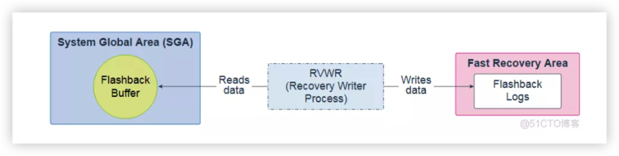

Recovery Writer Process（RVWR）是一个后台进程，用于闪回整个数据库。也就是说，只要您拥有所需的闪回日志，它就会将事务从数据库的当前状态撤消到过去的某个时间。启用闪回或有保证还原点时，RVWR会将闪回数据写入快速恢复区域中的闪回数据库日志。

RVWR可以作为线程或操作系统进程运行。

## 27.闪回数据存储进程
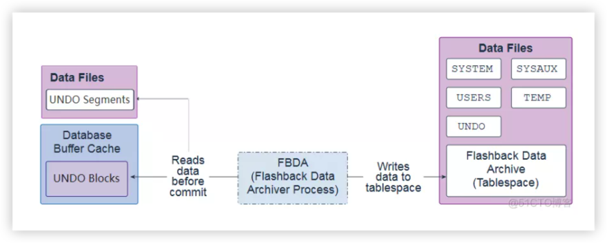

闪回数据存档进程（FBDA）是一个后台进程，可以在表的生命周期内跟踪和存储对表的事务更改。这样，您可以及时闪回表以恢复它们的方式。

当修改跟踪表的事务提交时，FBDA会检查是否生成了新的撤消，过滤了与标记为存档的对象相关的内容，以及将撤消信息的副本复制到闪回数据存档表空间中。FBDA维护当前行的元数据并跟踪已归档的数据量。

FBDA还负责自动管理空间，组织（分区表空间）和保留的闪回数据存档。FBDA还会跟踪跟踪交易的归档进度。

FBDA可以作为线程或操作系统进程运行。

## 28.空间管理协调进程

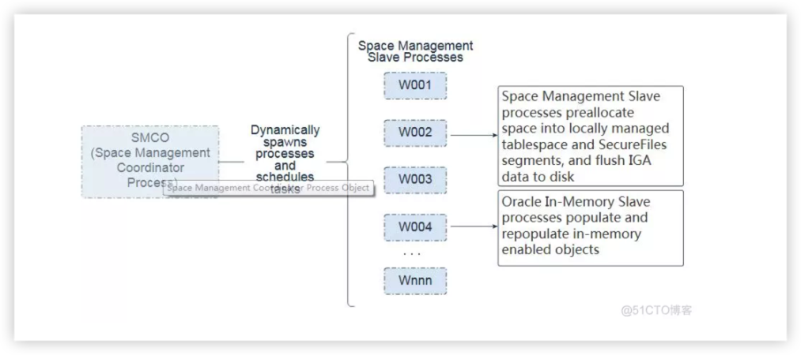

空间管理协调进程（SMCO）是一个后台进程，用于安排各种空间管理任务的执行，包括主动空间分配和空间回收。SMCO动态生成空间管理从属进程（Wnnn）来实现这些任务。请注意，内存协调器进程（IMCO）是一个后台进程，可启动背景填充和重新填充列数据。

w ^ NNN从进程，代表的空间管理，并代表Oracle内存选项的执行工作。
+ Wnnn进程是SMCO动态生成的从属进程，用于在后台执行空间管理任务。这些任务包+ 括根据空间使用增长分析将空间预分配到本地管理的表空间和SecureFiles段，以+ 及从丢弃的段中回收空间。任务还包括快速摄取延迟插入。启动后，奴隶充当自主代+ 理人。完成任务执行后，它会自动从队列中获取另一个任务。在闲置很长一段时间+ 后，该过程自行终止。
+ w ^NNN过程填充和重新填充内存启用对象。内存中协调器过程（IMCO）启动背景填充和柱状数据的重新填充。IMCO后台流程和前台流程将利用Wnnn奴隶进行人口和重新种群。W¯¯NNN过程由IMCO用于与内存中的启用的对象的预填充利用优先级低/中/高/ CRITICAL，和用于在内存中的对象的再增殖。在Wnnn从站上运行的内存中填充和重新填充任务也是从前台进程启动的，以响应引用内存启用对象的查询和DML。
  
SMCO和W nnn都可以作为线程或操作系统进程运行。

## 29.调度程序进程(Dnnn)和共享服务器进程(Snnn)
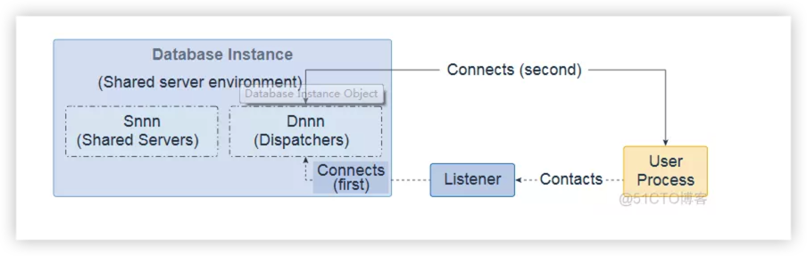

在共享服务器体系结构中，客户端连接到Dispatcher Process（Dnnn），它为每个连接创建一个虚拟电路。当客户端将数据发送到服务器时，调度程序将数据接收到虚拟电路中，并将活动电路放置在公共队列上，以便由空闲的共享服务器进程（Snnn）接收。然后，Snnn从虚拟电路读取数据并执行完成请求所需的数据库工作。当Snnn必须向客户端发送数据时，Snnn将数据写回虚拟电路，Dnnn将数据发送到客户端。在Snnn完成客户端请求之后，它将虚拟电路释放回Dnnn并可以自由处理其他客户端。

Snnn和Dnnn都可以作为线程或操作系统进程运行。除数据库实例外，Dnnn还可以在共享服务器上运行。
