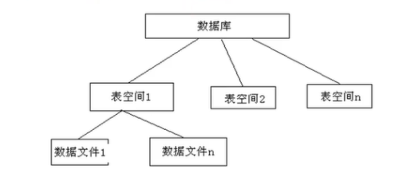

# Oracle 用户和角色
## 系统用户
### 默认系统用户
+ sys/system
+ sysman
+ scott
  
>默认密码为安装时设置的密码

### 系统用户说明
+ sys:超级用户，拥有最大权限，可以完成数据库所有管理任务
+ system:没有sys用户的权限大，通常用来创建一些用于查看管理信息的表和视图，同样不建议使用system架构来创建一些与管理无关的表和视图
+ sys和system 在登录Oracle工具时，sys只能以系统管理员(sysdba)或系统操作员(sysoper)的权限登录，而system可以直接登录(normal)
+ sysman:是Oracle数据库中用于EM管理的用户，如果不使用该用户，也可以删除
+ Scott：是Oracle提供的示例用户，里面有一些供初学者学习操作的数据表(emp,dept,salgrade,bonus)


## sqlplus 登录语法
Oracle 用户登录的语法格式
```
{<username>[/<password>][@<connect_identifier>] | / } [AS {SYSDBA |SYSOPER}]
```
+ username/password:指定数据库账户用户名，口令
+ connect_identifier:数据库连接的连接标识符(服务器名).如果没有连接标识符，SQLPLUS 将连接到默认数据库。
+ SYADBA、SYSOPER 选项是数据库管理权限
  + SYSDBA：数据库管理员权限
  + SYSOPER：数据库操作员权限

示例：
`[oracle@ldsr02 ~]$ sqlplus sys/abc123 as sysdba`


调整sqlplus 显示格式
```
set pagesize 1999 linesize 19999
set long 999999  
set serveroutput off
```


## 用户管理

### 查看当前所有用户
`select username from dba_users;`

### 创建用户
语法格式：
```
CREATE USER <username> IDENTIFIED BY <password> DEFAULT TABLESPACE <default tablespace> TEMPORARY TABLESPACE <temporary tablespace>;
```

使用示例：
```
create user user01 identified by abc123 default tablespace test1_tablespace temporary tablespace temp1_tablespace;
(如果创建用户不指定表空间，则默认表空间为 USER，临时表空间为 TEMP)
```

```
CREATE TABLESPACE CAOMENG   DATAFILE 'caomeng.dbf' SIZE 100M autoextend on;

CREATE USER CAOMENG IDENTIFIED BY oracle DEFAULT TABLESPACE CAOMENG;

alter user CAOMENG quota unlimited on CAOMENG;
```

### 用户授权
+ GRANT 权限 TO 用户名
示例：
``` grant connect to user01;```


### 其他用户管理操作
+ 连接用户
  + connect 用户名/口令
+ 更改密码
  + Alter user 用户名 identified by 新密码;
+ 锁定用户
  + Alter user 用户名 account lock;
+ 解锁用户
  + Alter user 用户名 account unlock;
+ 删除用户
  + drop user 用户名 cascade;
  + //加上cascade 则将用户连同其创建的东西全部删除


## Oracle 角色
### 角色
+ Oracle 角色(role) 就是一组权限的集合
+ 用户可以给角色赋予指定的权限，然后将角色赋予给相应的用户

### 三种标准角色
1. CONNECT(连接角色)
   拥有Connect权限的用户只可以登录Oracle，不可以创建实体，不可以创建数据库结构
2. RESOURCE(资源角色)
   拥有Resource权限的用户只可以创建实体，不可以创建数据库结构
3. DBA(数据库管理员角色)
   拥有全部特权，是系统最高权限，只有DBA才可以创建数据库结构

>对于普通用户：授予connect,resource 权限
对于DBA管理用户：授予dba 权限


### 创建角色
语法格式：
+ CREATE ROLE 角色名;
使用示例：
``` create role manager;```

### 将角色授权给用户
语法格式：
+ GRANT 角色 TO 用户;
使用示例：
```Grant manager to user01,user02; ```
授予连接角色的权限给user1
`grant connect to user1;`


### 回收角色
`revoke  role from user;`

### 删除角色
`drop role xxxx;`


# 表空间

##  表空间概念
+ 数据库与表空间
  + 表空间实际上是数据库上的逻辑存储结构，可以把表空间理解为在数据库中开辟的一个空间，用于存放我们的数据库对象，一个数据库可以有多个表空间构成。
+ 表空间与数据文件
  + 表空间实际上是由一个或多个数据文件构成的，数据文件的位置和大小可以有我们用户自己来定义。我们所操作的表和其他数据对象都是存放在数据文件中的。数据文件是物理存储结构，可以在文件系统中看到，而表空间是逻辑存储结构。
+ 结构示意图：



## 表空间分类
+ 永久表空间
+ 临时表空间
+ undo 表空间
  
## 表空间管理
### 表空间创建
```
CREATE [TEMPORARY] TABLESPACE tablespace_name TEMPFILE | DATAFILE 'xx.dbf' SIZE XX autoextend on;
```


### 查看表空间文件
`select file_name from dba_data_files;`
`select file_name from dba_data_files where tablespace_name ='D';`

### 查看用户表空间
表空间相关数据字典：
+ dba_tablespaces (管理员级别)
+ user_tablespaces (普通用户级别)
  
使用示例:
```
select tablespace_name from dba_tablespaces;
select tablespace_name from user_tablespaces;
```

用户表相关数据字典:
+ dba_users
+ user_users

使用示例:查看system 用户的表空间信息
```
select default_tablespace,temporary_tablespace from dba_users where username='SYSTEM';
```

### 设置用户默认或临时表空间
语法格式:
```
ALTER USER username DEFAULT|TEMPORARY TABLESPACE tablespace_name;
```
使用示例：
```
ALTER USER user01 DEFAULT TABLESPACE test1_tablespace TEMPORARY TABLESPACE test1_temp_tablespace;
```

解除用户表空间配额限制:
```
alter user user_name quota unlimited on tablespace_name;
```
一般会出现如下报错:

```
  ORA-01950: no privileges on tablespace 'WISDOMGOV'
  Import terminated successfully with warnings.
```

### 修改表空间
+ 修改表空间状态
  + 设置联机和脱机状态
  + `ALTER TABLESPACE tablespace_name ONLINE|OFFLINE;`
  + >如果一个表空间设置成脱机状态，表示该表空间暂时无法访问，不是删除。当需要时还可以设置为联机状态使其可用。
+ 修改表空间文件
  + 设置读写状态
  + `ALTER TABLESPACE tablespace_name  READ ONLY|READ WRITE;`
  + >默认是可读写状态
+ 查看表空间状态
  + `select status from dba_tablespaces where tablespace_name ='tablespace_1';`
+ 增加数据文件
  + `ALTER TABLESPACE tablespace_name ADD DATAFILE 'filename.dbf' SIZE xx;`
  + >向创建好的表空间里增加数据文件
+ 删除数据文件
  + `ALTER TABLESPACE tablespace_name DROP DATAFILE 'filename.dbf';`
  + >不能删除表空间中的第一个创建的数据文件，如果需要删除的话，我们需要把整个表空间删除。
+ 删除表空间
  + `DROP TABLESPACE tablespace_name [INCLUDING CONTENTS];`
  + >1. 如果删除时只是单纯的删除表空间，而不删除数据文件的话，可以`drop tablespace tablespace_name;`
    >2. 如果在删除表空间的同时还想把数据文件也删除的话，那么需要添加  `including contents`


# 权限
## 权限分类
+ 系统权限：允许用户执行特定的数据库动作，如创建表、创建索引、连接实例等。
+ 对象(实体)权限：允许用户操纵一些特定的对象，如读取视图，可更新某些列、执行存储过程等。

## 系统权限管理
### 查询Oracle所有系统权限
`select * from system_privilege_map;`
常用的系统权限如：
+ CREATE SESSION    创建会话
+ CREATE SEQUENCE   创建序列
+ CREATE TABLE      创建表
+ CREATE USER       创建用户
+ ALTER USER        更改用户
+ DROP USER         删除用户
+ CREATE VIEW       创建视图
  
### 授予系统权限语法
语法格式：

```
GRANT privilese [,privilege...] TO user [,user|role,PUBLIC...]
```

使用示例：
```
grant create table,create sequence to manager;
grant manager to user01,user02;

```

### 回收系统权限语句
语法格式：
```
REVOKE {privilege|role} from {user_name|role_name|PUBLIC}
```

使用示例：
```
revoke manager from user01;
revoke create table,create sequence from manager;
```

## 对象权限管理
### 查询Oracle 所有对象权限
`select * from table_privilege_map;`
+ 常用的对象权限如：
  + select,update,insert,delete,all 等
  + all 包括所有权限


### 授予对象权限
语法格式：
```
GRANT object_priv | ALL [(columns)] ON object TO {user|role|PUBLIC}
```
使用示例：
```
grant select,update,insert on scott.emp to manager;
grant manager to user01;
grant all on scott.emp to user02;
```


### 回收对象权限
语法格式：
```
REVOKE {privilege [,privilege...]|ALL } ON object FROM {user [,user ...]|role|PUBLIC}
```
使用示例：
```
revoke all on scott.emp from user01;
```


# 表
### 查看用户表
> 查看当前用户下的所有表

`select table_name from user_tables;`