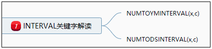

# 间隔分区

间隔分区是Oracle 11.1引入的新功能，通过该功能，可以在输入相应分区的数据时自动创建相应的分区。在没有间隔分区技术之前，DBA通常会创建一个maxvalue分区以避免ORA-14400：插入的分区键值不能映射到任何分区（"inserted partition key does not map to any partition") 错误。

作为范围分区（range partition）的扩展，间隔分区命令数据库在插入表中的数据超过所有现有范围分区时自动创建指定间隔的分区。DBA必须至少指定一个范围分区的较高值，称为过渡点，数据库会自动的为超出该过渡点的数据创建间隔分区，每个间隔分区的下边界是先前范围或间隔分区的上边界。

## 创建间隔分区

```
CREATE TABLE table_name
(
  ...
)
PARTITION BY RANGE(column1)
INTERVAL expr [STORE IN (tablespace1,[tablespace2,...])]
(
  PARTITION partition_name1 VALUES LESS THAN(literal | MAXVALUE) [TABLESPACE tablespace1],
  PARTITION partition_name2 VALUES LESS THAN(literal | MAXVALUE) [TABLESPACE tablespace2]
);
```
--PARTITION BY RANGE(column1):指定一个分区范围列
--INTERVAL:指定分区间隔
--STORE IN：指定分区存储的表空间

## 限制
间隔分区是范围分区的扩展，其支持范围有限，在Oracle 11g中，间隔分区只能指定一个分区键列，并且数据类型必须为NUMBER或者DATE类型。因为TIMESTAMP数据类型是DATE类型的扩展，可在分区键中使用。总结来说，间隔分区只支持NUMBER和TIME类型。

## INTERVAL 关键字

在创建自动间隔分区的时候，最为核心的就是”INTERVAL“关键字了。对于按照时间进行自动分区，INTERVAL后面可以跟随NUMTOYMINTERVAL和NUMTODSINTERVAL。两个关键字用法如下：

### NUMTOYMINTERVAL(x,c)
用法：x是一个数据，c是一个字符串，该函数是将x转为interval year to month类型。常用单位有：”year“、”month“。
实例：
```
SELECT   SYSDATE,
         SYSDATE + NUMTOYMINTERVAL(3,'year')  AS "3年后" ,
         SYSDATE + NUMTOYMINTERVAL(3,'month') AS "3个月后"
  FROM   dual;
```

### NUMTODSINTERVAL(x,c)
用法：x是一个数据，c是一个字符串，该函数是将x转为interval day to second类型。常用单位有：”day“、”hour“、”minute“、”second“。


## 实例

+ 按”年“自动创建分区（关键字：NUMTOYMINTERVAL）
```
--创建按年分区表

CREATE TABLE interval_year_table01
(
  employee_id         NUMBER,
  employee_name       VARCHAR2(20),
  birthday            DATE    
)
PARTITION BY RANGE(birthday)
INTERVAL (NUMTOYMINTERVAL(1,'year')) STORE IN (tbs01,tbs02,tbs03)
(
  PARTITION partition2014 VALUES LESS THAN(to_date('2015-01-01:00:00:00','yyyy-mm-dd hh24:mi:ss')),
  PARTITION partition2015 VALUES LESS THAN(to_date('2016-01-01:00:00:00','yyyy-mm-dd hh24:mi:ss'))
);
```
+ 按”月“自动创建分区（关键字：NUMTOYMINTERVAL）
```
-- 创建按月分区表

CREATE TABLE interval_month_table01
(
  employee_id         NUMBER,
  employee_name       VARCHAR2(20),
  birthday            DATE    
)
PARTITION BY RANGE(birthday)
INTERVAL (NUMTOYMINTERVAL(1,'month')) STORE IN (tbs01,tbs02,tbs03)
(
  PARTITION partition201401 VALUES LESS THAN(to_date('2014-02-01:00:00:00','yyyy-mm-dd hh24:mi:ss'))
);
```
+ 按”天（日）“自动创建分区（关键字：NUMTODSINTERVAL）
```
-- 按天（日）创建分区
CREATE TABLE interval_day_table01
(
  employee_id         NUMBER,
  employee_name       VARCHAR2(20),
  birthday            DATE    
)
PARTITION BY RANGE(birthday)
INTERVAL (NUMTODSINTERVAL(1,'day')) STORE IN (tbs01,tbs02,tbs03)
(
  PARTITION partition20140101 VALUES LESS THAN(to_date('2014-01-01 00:00:00','yyyy-mm-dd hh24:mi:ss'))
);
```
+ 按”周“自动创建分区（关键字：NUMTODSINTERVAL）
```
-- 按周创建分区

CREATE TABLE interval_week_table01
(
  employee_id         NUMBER,
  employee_name       VARCHAR2(20),
  birthday            DATE    
)
PARTITION BY RANGE(birthday)
INTERVAL (NUMTODSINTERVAL(7,'day')) STORE IN (tbs01,tbs02,tbs03)
(
  PARTITION partition201401w VALUES LESS THAN(to_date('2014-01-07 00:00:00','yyyy-mm-dd hh24:mi:ss'))
);
```
+ 按”小时“自动创建分区（关键字：NUMTODSINTERVAL）
```
-- 按”小时”进行分区
CREATE TABLE interval_hour_table01
(
  employee_id         NUMBER,
  employee_name       VARCHAR2(20),
  birthday            DATE    
)
PARTITION BY RANGE(birthday)
INTERVAL (NUMTODSINTERVAL(1,'hour')) STORE IN (tbs01,tbs02,tbs03)
(
  PARTITION partition20140100 VALUES LESS THAN(to_date('2014-01-01 01:00:00','yyyy-mm-dd hh24:mi:ss'))
);
```
+ 按数字（number）创建间隔分区
```
CREATE TABLE interval_number_table01
(
  employee_id         NUMBER,
  employee_name       VARCHAR2(20),
  birthday            DATE    
)
PARTITION BY RANGE(employee_id)
INTERVAL (10) STORE IN (tbs01,tbs02,tbs03)
(
  PARTITION partition10 VALUES LESS THAN(10)
);
```

## GET DDL 稳定
使用DBMS_METADATA.GET_DDL检索表时，为什么缺少系统生成的间隔分区？
"DBMS_METADATA.GET_DDL"只提供用户手段创建的分区，而不提供系统自动生成的分区。以下为测试例子
```
SQL> SELECT DBMS_METADATA.GET_DDL('TABLE','INTERVAL_NUMBER_TABLE01','LIJIAMAN') FROM DUAL;

DBMS_METADATA.GET_DDL('TABLE',
--------------------------------------------------------------------------------
  CREATE TABLE "LIJIAMAN"."INTERVAL_NUMBER_TABLE01" 
   (  "EMPLOYEE_ID" NUMBER, 
      "EMPLOYEE_NAME" VARCHAR2(20), 
      "BIRTHDAY" DATE
   ) PCTFREE 10 PCTUSED 40 INITRANS 1 MAXTRANS 255 
  STORAGE(
  BUFFER_POOL DEFAULT FLASH_CACHE DEFAULT CELL_FLASH_CACHE DEFAULT)
  TABLESPACE "USERS" 
  PARTITION BY RANGE ("EMPLOYEE_ID") INTERVAL (10) STORE IN ("TBS01", "TBS02", "TBS03") 
 (PARTITION "PARTITION10"  VALUES LESS THAN (10) SEGMENT CREATION IMMEDIATE 
  PCTFREE 10 PCTUSED 40 INITRANS 1 MAXTRANS 255 
  NOCOMPRESS LOGGING 
  STORAGE(INITIAL 8388608 NEXT 1048576 MINEXTENTS 1 MAXEXTENTS 2147483645
  PCTINCREASE 0 FREELISTS 1 FREELIST GROUPS 1
  BUFFER_POOL DEFAULT FLASH_CACHE DEFAULT CELL_FLASH_CACHE DEFAULT)
  TABLESPACE "USERS" )
```

如果要输出系统自动创建的分区的脚本，需将DBMS_METDATA的EXPORT参数设置为true

```
exec dbms_metadata.set_transform_param(dbms_metadata.SESSION_TRANSFORM,'EXPORT',true);
```