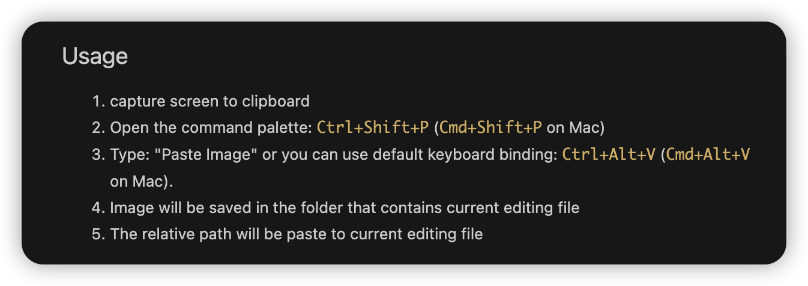

# **学习使用Markdowndown**
##1、标题分级
使用`#`表示标题，其中`#` 必须在行首。1个到6个 `#` 表示一级到六级标题.

- - -
##2、分割线
使用三个或以上的 `-` 或`*` 表示这一行只有符号，中间或前面可以添加空格
`---`


- - -
##3、斜体、加粗和删除线
使用 * 和 ** 分别表示斜体和粗体，删除线使用两个 ~ 表示


*斜体*   选中 Ctrl+I
**加粗** 选中 Ctrl+B
~~删除线~~ 选中 Alt+Shift+5
下划线 选中 Ctrl +U
<u>带下划线文本</u>


- - -
##4、超链接和图片
链接和图片的写法类似，图片仅在超链接前多了一个 ! ，一般是 [文字描述] (链接)
如下示例添加一个图片：


如下示例添加一个百度超链接：
[百度](https://www.baidu.com)

##5、无序列表
使用`-`、`+` 和 `*` 表示无序列表，前后留一行空白，可嵌套。
示例如下：
+ 一层
    - 二层
    - 二层
        * 三层
+ 一层

##6、有序列表
使用 `1. `(点号后面有个空格) 表示有序列表，可嵌套。
示例如下：
1. 一层
   1. 二层
   2. 二层
2.  一层
    
- - -
##7、文字引用
使用`>` 表示，可以使用多个`>`, 表示层级更深。
示例如下：
>第一层
>>第二层
>>>第三层
>    
> 第一层

>另起一层

- - -

##8、行内代码块
使用 ` 表示，例如
扩展：很多字符是需要转义，使用反斜杠 \ 进行转义

`行内代码块`

- - - 

##9、代码块
```
create database cm;
create table cm.cm(id int primary key);
```

- - -

##10、表格
第二行的 ---: 表示了对齐方式，默认左对齐，还有 右对齐 和 居中。
`-`有一个就行，为了对齐，多加了几个
文字默认居左
-两边加：表示文字居中
-右边加：表示文字居右
示例如下：

|商品|数量|单价
|--|-------:|:-------:|
|苹果|10|\$1|
|电脑|1|\$1000|

- - -
##11、流程图
主要的语法为 name=>type: describe，其中 type 主要有以下几种：
1.  开始和结束：start end
2.  输入输出：inputoutput
3.  操作：operation
4.  条件：condition
5.  子程序：subroutine

- - -

##12、快捷方式
+ 缩进
    增加缩进 Ctrl +]
    减少缩进 Ctrl +[


  增加
    减少

+ 开关任务列表
  Alt + C 开关列表
  - [x] todo
  - [ ] todo
  - [ ] todo
+ 字体
    *斜体*   选中 Ctrl+I
    **加粗** 选中 Ctrl+B
    ~~删除线~~ 选中 Alt+Shift+5
    下划线 选中 Ctrl +U
+ 格式化表格
  Shift + Alt + F
+ 高亮
  ==高亮==


- - - 
## 粘贴图片
cmd+Alt+v
